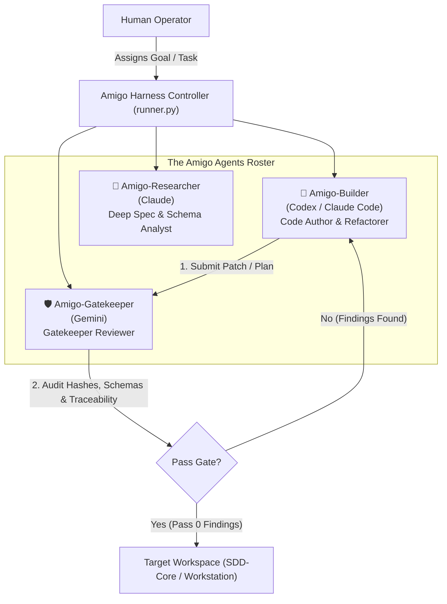
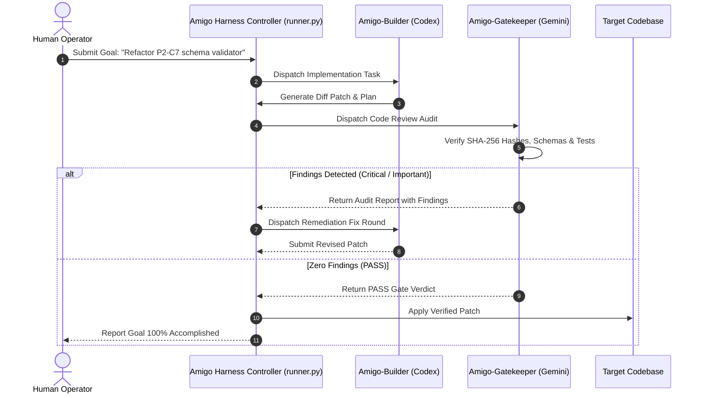

# 🤝 Amigo Agents: Multi-Agent Collaboration & Review Harness Blueprint

## 1. Executive Summary & Vision

**Amigo Agents** is an external multi-agent collaboration harness. It orchestrates a team of specialized AI agents—**Amigo-Builder** (Codex / Claude Code), **Amigo-Gatekeeper** (Gemini), and **Amigo-Researcher** (Claude)—to collaborate on software engineering tasks outside governing project directories.

By decoupling the review and execution harness from target codebases, Amigo Agents provide automated pair-programming, substantive gatekeeper code reviews, and schema verification without polluting target repository manifests or breaking SHA-256 integrity trees.

---

## 2. Multi-Agent Roster & Roles

### 1. Amigo-Builder (`agents/builder.json`)
- **Primary Model:** Codex / Claude Code
- **Responsibility:** High-velocity code authoring, diff patch synthesis, implementation plan drafting, and unit test runner updates.

### 2. Amigo-Gatekeeper (`agents/reviewer.json`)
- **Primary Model:** Gemini (Sr. AI Engineer & Full Stack Developer)
- **Responsibility:** Substantive gatekeeper code reviews, cryptographic SHA-256 manifest verification, strict Draft 2020-12 schema validation, and security threat auditing.

### 3. Amigo-Researcher (`agents/researcher.json`)
- **Primary Model:** Claude / Subagent
- **Responsibility:** Deep spec analysis, cross-repository dependency tracing, and requirement-to-test mapping.

---

## 3. Automated Remediation Loop Sequence

---

## 4. Key Security & Isolation Rules

1. **External Working Directory:** All temporary review packages, audit logs, and fix round deltas must be written inside `Amigos-Agents/logs/` or `Amigos-Agents/harness/`.
2. **Predecessor Immutability:** Amigo Agents never modify predecessor manifests or accepted package files directly during review cycles.
3. **Deterministic Output:** All code review artifacts use standardized naming (`Gemini_[YYYY-MM-DD]_[HH-MM-SS]_[ReviewType].md`) and clear pass/fail criteria.
