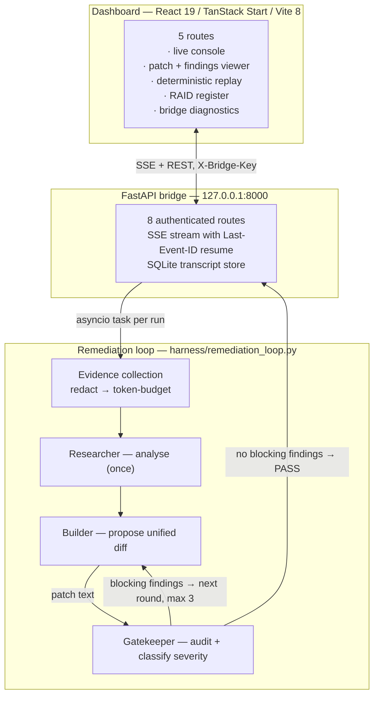

# SDD-Core CITADEL

**A multi-agent code review harness that fails closed.**

Three LLM roles — Researcher, Builder, Gatekeeper — run a bounded propose-and-audit loop
against a target repository, streaming every step to a monitoring dashboard over
server-sent events. The Builder proposes unified diffs. The Gatekeeper audits them and
classifies findings by severity. Nothing is ever written to the target directory.

| | |
| :-- | :-- |
| **Tests** | 162 passing on Python 3.11 and 3.12 |
| **CI gates** | pytest × 3 provider configs · provider-invariance diff · typecheck · build · lint |
| **Write model** | Propose-only. No filesystem write path exists in the Builder. |
| **Status** | Working prototype. Three known defects are documented in [Known Limitations](#known-limitations). |

---

## Table of contents

- [What this is, and what it isn't](#what-this-is-and-what-it-isnt)
- [The design rule](#the-design-rule)
- [Architecture](#architecture)
- [Providers and models](#providers-and-models)
- [Repository layout](#repository-layout)
- [Quick start](#quick-start)
- [CLI](#cli)
- [HTTP API](#http-api)
- [The SSE event contract](#the-sse-event-contract)
- [Configuration](#configuration)
- [Testing and CI](#testing-and-ci)
- [Security posture](#security-posture)
- [Known limitations](#known-limitations)
- [License](#license)

---

## What this is, and what it isn't

**It is** a working harness for running a reviewed, bounded, multi-provider agent loop
against a local repository, plus a dashboard for watching and replaying those runs. The
engineering effort has gone into the failure paths rather than the feature list:
what happens when a provider returns an empty body, when a quota is exhausted, when an
environment variable holds an unexpected value, when a secret is sitting in the file
under review.

**It is not** a hosted product, a CI bot, or an autonomous agent that commits code. It runs
on localhost, it requires a human to apply any patch it produces, and it has no
authentication model beyond a single shared secret.

Scope boundaries worth stating up front:

- The Builder cannot write files. Patches are returned as unified diff text.
- The bridge binds `127.0.0.1` by default and speaks plain HTTP.
- The dashboard has no automated tests. Its CI gate is typecheck, build, and lint.
- Python dependencies are unpinned (`>=` only). There is no dependency scanning.

---

## The design rule

Every non-obvious decision in this repository traces back to one rule:

> **A control that reports success while doing nothing is worse than no control.**

The naïve version of a merge gate parses an empty Gatekeeper response as zero findings.
Zero findings reads as *the patch is clean*. So a review that produced no output at all
would approve a patch nobody had reviewed. That is the failure this codebase is organised
around, and most of what follows is a consequence of it:

| Concern | The failure it prevents |
| :-- | :-- |
| `_empty_review_findings()` | An empty or blank model response approving an unreviewed patch. |
| Per-finish-reason handling | A token cutoff being reported as "unparseable output" — the wrong cause. |
| Whole-batch rejection | Acting on a review that has already been proven unparseable. |
| Cross-provider parity test | A gate that fails closed on one provider and open on another. |
| `check_provider_invariance.py` | Three green test runs that did not run the same tests. |
| Redact-then-truncate ordering | A secret past the token budget being dropped instead of redacted, while the transcript persists the untruncated copy. |
| Fail-closed secret scanning | A scan error returning unscanned text. |
| Three-part-or-nothing fallback config | A primary API key reaching a third-party fallback endpoint. |
| Serial event drain | Out-of-order transcript writes breaking deterministic replay. |
| Unattributed provider badge | A finding confidently badged with the wrong vendor. |

Source comments state the incident behind each one. That convention is deliberate: an
instruction that carries its reason survives contact with a situation the author did not
anticipate.

---

## Architecture



The loop runs at most **3 rounds**. The Researcher runs **once**, outside the loop —
research is task-scoped, not round-scoped. Each round appends a record containing the
patch, the findings, and the provider and model that actually produced them.

**Verdicts.** `PASS` when a round produces no blocking findings; `UNRESOLVED` when all three
rounds still block. There is deliberately no `FAIL` — the harness has not proven the patch
bad, it has run out of budget.

**Severity.** `CRITICAL` and `WARNING` block a merge. `NOTE` does not. That third level
exists so a reviewer's observation about *pre-existing* code cannot burn every remediation
round on a defect the patch never introduced. The Gatekeeper prompt explains diff semantics
explicitly so the model can tell added lines from orientation context.

---

## Providers and models

Four providers across three roles. The Gatekeeper is switchable at runtime.

| Role | Provider | Default model | Model override | API surface |
| :-- | :-- | :-- | :-- | :-- |
| Researcher | Anthropic | `claude-opus-5` | `ANTHROPIC_MODEL` | `messages.create` |
| Builder | OpenAI | `gpt-5.3-codex` | `OPENAI_MODEL` | `responses.create` |
| Gatekeeper *(default)* | Google Gemini | `gemini-3.6-flash` | `GEMINI_MODEL` | `aio.models.generate_content`, JSON response schema |
| Gatekeeper *(opt-in)* | Moonshot / Kimi | `kimi-k3` | `MOONSHOT_MODEL` | `chat.completions` via OpenAI-compatible endpoint |

Select the Gatekeeper with `GATEKEEPER_PROVIDER=gemini|kimi` (case-insensitive; empty or
whitespace counts as unset and yields `gemini`). An unrecognised value **raises** rather
than silently defaulting.

### Quota fallback

Each role can retry **once** against a fallback endpoint on a quota / rate-limit error
(HTTP 429). Non-quota errors — 401, malformed request — fail fast rather than being retried
elsewhere. There is no backoff, by design: backoff does not help an exhausted quota.

A role's fallback activates only when **all three** of these are set:

```
<ROLE>_FALLBACK_BASE_URL
<ROLE>_FALLBACK_MODEL
<ROLE>_FALLBACK_API_KEY      # required, and distinct from the primary key
```

for `<ROLE>` in `RESEARCHER`, `BUILDER`, `GATEKEEPER`. Requiring a separate key is what
guarantees the primary provider's credential can never be sent to a fallback endpoint that
may not be operated by the same trusted party. Eight tests pin that guarantee.

A fallback only re-points the *primary provider's own client*, so the endpoint must speak
that provider's protocol — under `GATEKEEPER_PROVIDER=gemini` the URL must serve Gemini
REST, because `google-genai` never requests `/chat/completions`.

---

## Repository layout

```text
sdd-core-citadel/
├── AGENTS.md                          Standing conduct rules for agents working in this repo
├── RESUME.md                          Operational handoff: setup, backlog, gotchas, accepted risks
├── requirements.txt                   Python dependencies
├── pytest.ini                         asyncio_mode = auto
├── .env.example                       Annotated configuration template
├── .coderabbit.yaml                   Review config, plus a recorded decision against auto-fix
│
├── harness/                           Bridge server and orchestration
│   ├── bridge.py                      FastAPI app, SSE stream, SQLite transcript store
│   ├── BRIDGE_README.md               Bridge contract and auth notes
│   ├── remediation_loop.py            The propose → audit → remediate cycle
│   ├── llm_clients.py                 Provider clients, quota fallback, findings validation
│   ├── evidence_collector.py          Git diff + focus files, secret redaction, token budget
│   ├── config.py                      .env loading, target dir, Gatekeeper provider resolution
│   └── runner.py                      CLI entry point
│
├── agents/                            Role wrappers and prompts
│   ├── researcher.py                  Spec/evidence analysis
│   ├── builder.py                     Patch proposal (propose-only)
│   └── gatekeeper.py                  Review prompt, severity rules, has_blocking_findings()
│
├── tools/
│   ├── check_provider_invariance.py   Diffs JUnit XML across provider configs (CI gate)
│   ├── git_adapter.py                 git status/diff via argv, no shell
│   └── linter_adapter.py              JSON syntax + SHA-256 validation
│
├── tests/                             13 files, 162 tests, every provider call mocked
│
├── dashboard/                         React 19 monitoring UI (Bun, not npm)
│   └── src/
│       ├── routes/                    index · patches · replay · raid · system
│       ├── components/citadel/        Domain components
│       ├── components/ui/             shadcn / Radix primitives
│       ├── lib/citadel/               Zod event contract, API client, replay statistics
│       └── hooks/useAgentStream.ts    EventSource driver, backoff, demo playback
│
└── .github/workflows/
    ├── ci.yml                         Test and build gate on PRs and pushes to main
    └── claude.yml                     @claude mention responder
```

Runtime output — `logs/`, `citadel.sqlite3`, `.codegraph/` — is gitignored and absent from
a fresh clone.

---

## Quick start

### Requirements

Python **3.11 or 3.12**, [Bun](https://bun.sh) (the dashboard's `bun.lock` is tracked; npm
resolves a different tree), and `git`.

### 1. Configure the environment

```bash
cp .env.example .env
```

`.env.example` ships `BRIDGE_API_KEY=` **empty on purpose** — a placeholder string would be
a working shared secret published in a public repository. Generate your own:

```bash
python3 -c 'import secrets; print(secrets.token_urlsafe(32))'
```

Minimum working configuration:

```bash
BRIDGE_API_KEY=<generated above>     # required; the bridge refuses to start without it
ANTHROPIC_API_KEY=sk-ant-...         # Researcher
OPENAI_API_KEY=sk-proj-...           # Builder
GEMINI_API_KEY=AIza...               # Gatekeeper (default provider)
```

Then restrict the file's permissions — with a typical `022` umask an editor creates it at
mode `0644`, readable by every account on the machine:

```bash
chmod 600 .env
```

`harness/config.py` loads `.env` with `os.environ.setdefault`, so a real environment
variable always wins over the file.

### 2. Install Python dependencies

On Ubuntu 24.04 and other PEP 668 distributions a virtual environment is mandatory — bare
`pip install` fails with `externally-managed-environment`.

```bash
python3 -m venv .venv
source .venv/bin/activate
pip install -r requirements.txt
```

### 3. Start the bridge

```bash
python -m harness.bridge          # 127.0.0.1:8000
```

### 4. Start the dashboard

```bash
cd dashboard
bun install --frozen-lockfile
bun run dev                        # http://localhost:5173
```

The dashboard opens in **demo mode**, which replays a deterministic 18-event fixture
transcript with no API keys and no model spend. Switch to live mode and enter your
`BRIDGE_API_KEY` in the connection panel to drive a real run.

### 5. Verify

```bash
pytest tests/ -q                   # expect: 162 passed
cd dashboard && bun run typecheck && bun run build && bun run lint
```

---

## CLI

```bash
# Environment status — reports only the ACTIVE Gatekeeper provider's key
python -m harness.runner --status

# Run a cycle against a target directory
python -m harness.runner --task "Fix the race condition in the SSE subscriber teardown" \
                         --target-dir /path/to/repo
```

The runner prints the verdict, the transcript path, and the proposed patch. It does not
apply anything.

---

## HTTP API

All eight routes require the shared secret. Seven accept it **only** as the `X-Bridge-Key`
header. `GET /api/stream/{run_id}` additionally accepts `?key=` because the browser's
native `EventSource` cannot set custom headers — that exception is confined to one route
because query parameters land in access logs, proxy logs, and browser history, and a
regression test asserts every other route rejects the query form.

| Method | Route | Purpose |
| :-- | :-- | :-- |
| `POST` | `/api/run-task` | Start a run. Returns `{run_id, status}`. |
| `GET` | `/api/stream/{run_id}` | SSE event stream, with `Last-Event-ID` resume. |
| `GET` | `/api/logs` | Run index. |
| `GET` | `/api/logs/{run_id}` | Full transcript for replay. |
| `GET` | `/api/raid` | RAID register entries. |
| `POST` | `/api/raid` | Create a RAID entry. |
| `GET` | `/api/system/health` | Liveness, uptime, active runs, DB reachability. |
| `GET` | `/api/system/status` | Per-provider key presence, configured models, active Gatekeeper. |

`POST /api/run-task` accepts `{task, target_dir?, max_rounds?, mode?, apply_patch?, write?}`
and **rejects with `WRITE_REJECTED`** if `apply_patch` or `write` is true, or if `mode` is
anything other than `propose`. See [Known Limitations](#known-limitations) regarding
`max_rounds`.

---

## The SSE event contract

Five event types, modelled on the frontend as a Zod discriminated union keyed on the SSE
event name. `parseSseEvent` returns `null` on any validation failure, so a malformed frame
is dropped rather than admitted into application state.

| Event | Payload |
| :-- | :-- |
| `stage_change` | `stage`, optional `agent`, `round`, `verdict` |
| `agent_message` | `agent`, `round`, `message_type` (`RESEARCH_NOTES` / `PATCH` / `AUDIT_FINDINGS`), `content` or `findings`, `provider`, `model` |
| `token_metric` | `agent`, `round`, `input_tokens`, `output_tokens`, `elapsed_ms` |
| `run_complete` | `verdict`, `rounds_total`, `patch_text` |
| `error` | `error_code` — synthesised by the bridge, since the loop raises plain exceptions |

Plus `ping` keepalives every 15 seconds and an internal `close` frame that terminates the
generator.

Two behaviours worth knowing. `provider` and `model` use `.catch(undefined)` rather than
`.optional()`, so an unrecognised provider string degrades to *unattributed* instead of
silently dropping the whole audit message. And the client drives its own reconnect — capped
exponential backoff at 3s, 6s, 12s, 24s, then 30s, up to 8 attempts, then a terminal
`lost` state with a manual retry — rather than relying on the browser's native retry.

The bridge's completion path flushes and awaits the transcript drain queue **before**
marking a run finished, so any consumer that observes `finished` is guaranteed the full
transcript is already durable in SQLite, in order.

---

## Configuration

### Required

| Variable | Purpose |
| :-- | :-- |
| `BRIDGE_API_KEY` | Bridge shared secret. The bridge refuses to start without it; every route returns 401 until it matches. Not vendor-issued — generate your own. |
| `ANTHROPIC_API_KEY` | Researcher. |
| `OPENAI_API_KEY` | Builder. |
| `GEMINI_API_KEY` *or* `MOONSHOT_API_KEY` | Gatekeeper, depending on `GATEKEEPER_PROVIDER`. |

### Optional

| Variable | Default | Purpose |
| :-- | :-- | :-- |
| `GATEKEEPER_PROVIDER` | `gemini` | `gemini` or `kimi`. Empty/whitespace means unset. An unrecognised value raises. |
| `ANTHROPIC_MODEL` | `claude-opus-5` | Researcher model id. |
| `OPENAI_MODEL` | `gpt-5.3-codex` | Builder model id. |
| `GEMINI_MODEL` | `gemini-3.6-flash` | Gatekeeper model id (Gemini). |
| `MOONSHOT_MODEL` | `kimi-k3` | Gatekeeper model id (Kimi). |
| `AMIGO_TARGET_DIR` | repo root | Default target directory for the CLI and bridge. |
| `BRIDGE_ALLOWED_TARGET_DIRS` | resolved `AMIGO_TARGET_DIR` | **Security-relevant.** Comma-separated allowlist of roots a run's `target_dir` may resolve inside. |
| `CITADEL_DB` | `citadel.sqlite3` | SQLite path. |
| `CITADEL_HOST` | `127.0.0.1` | Bind address. See [Security posture](#security-posture) before changing. |
| `CITADEL_PORT` | `8000` | Bind port. |
| `<ROLE>_FALLBACK_BASE_URL` / `_MODEL` / `_API_KEY` | unset | Per-role quota fallback. All three required to activate. |

`.env.example` currently documents 16 of these. The remaining runtime variables
(`AMIGO_TARGET_DIR`, `BRIDGE_ALLOWED_TARGET_DIRS`, `CITADEL_DB`, `CITADEL_HOST`,
`CITADEL_PORT`, and the three `*_MODEL` overrides) are documented here.

---

## Testing and CI

```bash
pytest tests/ -q          # 162 tests, ~3s, every provider call mocked
```

**No API keys are supplied to CI, deliberately.** If a test ever starts requiring a real
key, it fails in the build rather than silently reaching a live endpoint from a runner.

`ci.yml` runs two jobs on every pull request and every push to `main`, with top-level
`contents: read` permission, concurrency cancellation, and all actions pinned to full
commit SHAs rather than mutable tags.

**Job `python`** — matrix `3.11` and `3.12`, `fail-fast: false`. Runs the suite three times
with `--junitxml`:

1. `GATEKEEPER_PROVIDER` explicitly `unset`
2. `GATEKEEPER_PROVIDER=kimi`
3. `GATEKEEPER_PROVIDER=""` — a third distinct case, matching the parser's
   empty-means-default rule

then diffs the three reports with `tools/check_provider_invariance.py`:

> Three green pytest runs prove each configuration passes. They do **not** prove the three
> runs executed the same tests. A provider-dependent skip, or a collection difference
> caused by an import-time environment read, leaves every run green while quietly
> shrinking coverage. This repo has already hit that: an ambient `GATEKEEPER_PROVIDER`
> turned 12 previously-passing tests red.

The checker reports three categories separately — tests missing, tests extra, outcomes
changed — because "the runs differ" is not actionable on its own. It also raises on
duplicate test ids and on an empty baseline report, so it cannot itself fail open.

**Job `dashboard`** — Bun with `--frozen-lockfile`, then `typecheck`, `build`, and `lint` as
three separate steps. Typecheck is its own step because `vite build` does not typecheck:
esbuild strips types without checking them, so a green build is not a green typecheck.

**Review.** CodeRabbit runs on `main` in assertive mode, with `AGENTS.md` fed in as code
guidelines and `auto_pause_after_reviewed_commits: 5` left at the default as a loop brake.
`.coderabbit.yaml` also records a reasoned decision **against** wiring auto-fix into
`pull_request` — this repository is public, `pull_request_target` runs with base-repo
secrets, and action logs are world-readable. Tests, typecheck, build, review, and
merge-blocking are automatic. The fix step keeps a human gate.

**Branch protection.** PR required before merge, conversation resolution required (this is
what makes review findings actually block), four named checks green, linear history,
force-push and deletion blocked.

---

## Security posture

### Enforced

- **Startup fail-closed.** The bridge raises at startup if `BRIDGE_API_KEY` is unset, naming
  the variable.
- **Constant-time comparison.** `hmac.compare_digest`; missing or empty supplied values
  short-circuit to 401.
- **Header-only auth** on seven of eight routes; the `?key=` form is scoped to the SSE
  stream alone, with a regression test per route and a second test asserting an
  empty-but-present header cannot fall through to the query key.
- **Path allowlisting.** `target_dir` is `resolve()`d then containment-checked against
  `BRIDGE_ALLOWED_TARGET_DIRS`, defeating `../` traversal and symlinks. Two error codes,
  ordered `TARGET_NOT_ALLOWED` before `BAD_TARGET`, so the endpoint cannot be used to probe
  filesystem existence outside the allowlist. The same guard is applied independently to
  every path-shaped token scraped from the task description.
- **Propose-only.** Architectural, not a flag — the Builder has no filesystem write path.
- **CORS** restricted to the two dashboard dev origins; credentials not enabled, since auth
  is a header rather than a cookie.
- **Subprocess hygiene.** `git` is invoked with a list argv, never `shell=True`.
- **Secret redaction before truncation** in evidence collection, covering cloud access
  keys, named credential assignments (quoted and unquoted), PEM private-key blocks, and
  JWTs. Redaction preserves the key's *name* and quoting while destroying the value, so the
  reviewing model still learns a credential is present. A scan error replaces the entire
  text with a placeholder and sets a flag; it never returns unscanned text. Per-file and
  per-diff `secrets_redacted` booleans are surfaced so a clean scan is distinguishable from
  a scan that fired.
- **Fallback key isolation.** A fallback cannot activate without its own key, so no code
  path exists that sends a primary credential to a fallback endpoint.

### Residual and accepted

Stated rather than omitted, on the principle that a control credited with coverage it does
not have is itself a control reporting success while doing nothing.

- **Secret scanning is name-anchored, not entropy-based.** A bare opaque bearer token with
  no adjacent keyword is not caught.
- **The bridge speaks plain HTTP.** Localhost binding is a *default*, not an enforcement.
  Setting `CITADEL_HOST=0.0.0.0` sends the shared secret across the network in cleartext.
- **The bridge key is persisted in browser `localStorage`**, which is an XSS exposure.
- **Python dependencies are unpinned** (`>=`, no hashes, no lockfile) and there is no
  dependency scanning, Dependabot config, or SAST job — an asymmetry with the SHA-pinned
  GitHub Actions that is worth closing.
- **No WAL or `busy_timeout` on SQLite.** Thread safety comes from connection-per-call
  rather than journal mode; under concurrent runs a `database is locked` error is possible
  and is currently only printed.
- **A prior workstation username and an unrelated absolute path remain in several tracked
  files** from the initial commit. Removing them requires a source change plus a second
  force-push; tracked as an accepted risk in `RESUME.md`.
- **Git history was rewritten** to purge run transcripts, research documents, and local
  artefacts. `.gitignore` prevents future tracking but does not retroactively remove
  anything from clones taken before the rewrite.

---

## Known limitations

These are verified defects, documented with reasoning and file references in `RESUME.md`.
All three are the same shape — a control that reports success while doing nothing — which
is why they are listed here rather than left for a reader to discover.

| # | Defect | Impact |
| :-- | :-- | :-- |
| **A1** | `max_rounds` is validated at two layers (`contract.ts`, `bridge.py`, both `1–6`) and then never threaded into `run_collaboration_cycle`, which hardcodes `MAX_ROUNDS = 3`. | Select 6, get 3. Select 1, get 3. A **governance** defect that fails *open*: the operator's control over how many times an unreviewed patch regenerates is inert. |
| **A2** | The dashboard's cancel button closes the `EventSource` and reports `cancelled`, but makes no call to the bridge. The run's asyncio task holds a deliberate strong reference and continues. | The run completes, billing all three providers and writing to SQLite, while the UI reports it stopped. |
| **A3** | `components/amigo/TaskDispatcher` discards its input and then displays a confirmation containing the discarded value. | Part of an orphaned prototype subtree (~700 lines) that nothing imports; slated for removal. |

Other known gaps:

- The frontend `STAGES` enum stops at round 2 while `MAX_ROUNDS = 3`, so a third round's
  stage frames fail validation and are dropped by the UI — precisely on the runs that
  needed the most remediation.
- An unknown `Last-Event-ID` yields an empty replay rather than an error.
- A reconnect can miss events emitted between the end of the replay phase and subscriber
  registration.
- `logEntrySchema.verdict` does not accept `ERROR`, which the bridge writes on a failed
  run.
- The token budget covers evidence collection, not final prompt assembly — the Gatekeeper
  prompt still truncates its diff by character count.
- Evidence collection runs synchronously on the event loop, and `git` subprocesses have no
  timeout.
- `dashboard/package.json` is still named `tanstack_start_ts` from the scaffold.

---

## License

MIT. See [LICENSE](LICENSE).

---

<sub>Contributions follow the standing rules in [AGENTS.md](AGENTS.md). Operational setup,
backlog priority, and environment gotchas live in [RESUME.md](RESUME.md).</sub>
