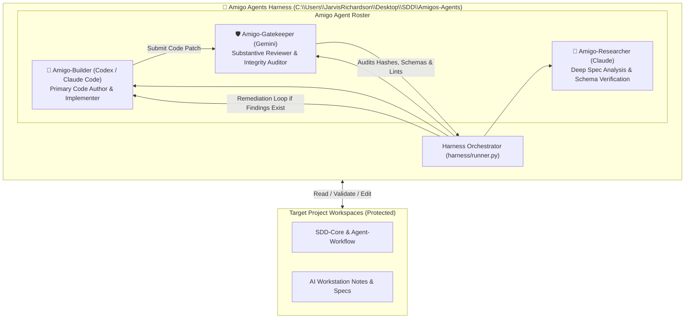

# 🤝 Amigo Agents — Multi-Agent Collaboration & Review Harness

> **The Outside Builders & Gatekeeper Harness** | Isolated Multi-Agent Pair-Programming Framework

Welcome to **Amigo Agents**, the external multi-agent collaboration and review harness. Amigo Agents operate outside governed project packages (such as `SDD-Core` or `Agent-Workflow`) to coordinate multiple AI coding assistants—including **Codex**, **Claude Code**, and **Gemini**—to build, review, refactor, and audit software components in parallel.

---

## 🏛️ System Architecture



---

## 📂 Repository Layout

```text
Amigos-Agents/
├── README.md                           <-- Master Index & Harness Overview
├── AMIGO_AGENTS_HARNESS_BLUEPRINT.md   <-- Detailed Multi-Agent Collaboration Blueprint
├── AGENTS.md                           <-- Amigo Agents Standing Directives & Conduct Rules
│
├── harness/                            <-- Multi-Agent Collaboration Orchestrator
│   └── runner.py                       <-- Python harness controller & execution loop
│
├── agents/                             <-- Agent Roster & Persona Definitions
│   ├── builder.json                    <-- Amigo-Builder (Codex / Claude Code) profile
│   ├── reviewer.json                   <-- Amigo-Gatekeeper (Gemini) profile
│   └── researcher.json                 <-- Amigo-Researcher (Claude) profile
│
├── tools/                              <-- Shared Validation & Diff Inspection Helpers
│   ├── sha256_verifier.py              <-- Predecessor manifest hash verifier
│   └── lint_runner.py                  <-- JSON Schema Draft 2020-12 linter wrapper
│
└── logs/                               <-- Execution Transcripts & Gatekeeper Reviews
```

---

## 🔑 Core Features & Operating Principles

1. **Zero-Contamination Isolation:** Amigo Agents live completely outside target project directories. All execution logs, review transcripts, and transient fix packages are stored in `Amigos-Agents/`, keeping target manifests and SHA-256 hashes untouched.
2. **Automated Implementer-Reviewer Loop:**
   - **Amigo-Builder (Codex / Claude Code):** Generates code patches and implementation plans.
   - **Amigo-Gatekeeper (Gemini):** Audits code against security guidelines (`Directive-1.md`), verifies file table hashes, and checks strict schema constraints.
   - If findings exist, the harness automatically feeds them back to the builder for remediation before human intervention.
3. **Multi-Model Intelligence:** Leverages the unique strengths of each AI model (fast code authoring + deep cryptographic & architectural review).
