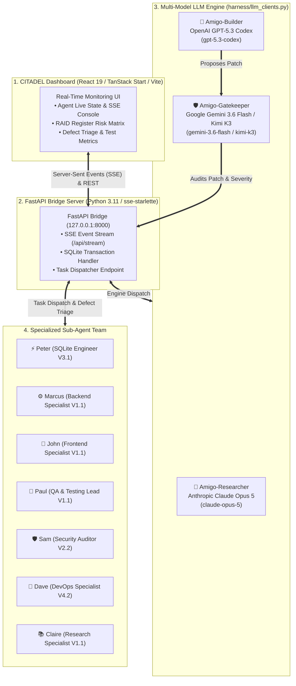

# 🤝 SDD-Core CITADEL & Amigo Agents Framework

> **The Multi-Agent Autonomous Engineering Engine & Real-Time Monitoring Dashboard**  
> *Orchestrating AI Agents (Claude Code, Gemini, Codex, Kimi) for High-Assurance Software Delivery, Real-Time SSE Telemetry, and Automated Defect Triage.*

---

## 🏛️ System Architecture & LLM Provider Roster

**SDD-Core CITADEL** (`hanax-ai/sdd-core-citadel`) is an enterprise-grade multi-agent software engineering framework and real-time operational dashboard. It coordinates a team of specialized AI agents across a **4-stage software development lifecycle** (`Discover` → `Plan` → `Execute` → `Validate & Remediate`).



---

## 🤖 LLM Models & AI Providers

The harness orchestrates multi-model intelligence across 3 core LLM agent tiers:

| Agent Tier | Primary LLM Provider | Default Model | Environment Override | Purpose & Function |
| :--- | :--- | :--- | :--- | :--- |
| **🔬 Amigo-Researcher** | **Anthropic** | `claude-opus-5` | `ANTHROPIC_MODEL` | Deep specification analysis, schema verification, and evidence synthesis. |
| **🔨 Amigo-Builder** | **OpenAI** | `gpt-5.3-codex` | `OPENAI_MODEL` | Generates unified diff patches (`.patch`) in propose-only mode (never writes files directly). |
| **🛡️ Amigo-Gatekeeper (Default)** | **Google Gemini** | `gemini-3.6-flash` | `GEMINI_MODEL` | Audits proposed patches against security guidelines; classifies findings (`CRITICAL`, `WARNING`, `NOTE`). |
| **🛡️ Amigo-Gatekeeper (Opt-In Switch)** | **Moonshot AI** | `kimi-k3` | `MOONSHOT_MODEL` | Alternative Gatekeeper provider switch (`GATEKEEPER_PROVIDER=kimi`) via OpenAI-compatible endpoint. |

### 🛡️ Provider Fallback & Quota Protection
The harness includes per-role fallback base URLs, fallback models, and fallback API keys (`RESEARCHER_FALLBACK_*`, `BUILDER_FALLBACK_*`, `GATEKEEPER_FALLBACK_*`). On 429 / rate limit errors, calls automatically fail over to configured fallback endpoints without breaking the pipeline.

---

## 🚀 Key System Capabilities

### 1. 🎨 Real-Time CITADEL Monitoring Dashboard (`/dashboard`)
- **Modern Full-Stack UI:** Built on **React 19**, **TanStack Start/Router**, **Vite 8**, **Tailwind CSS v4**, and **Zustand**.
- **Live Agent Activity Console:** Streams real-time sub-agent execution logs and progress metrics via Server-Sent Events (SSE).
- **RAID Register Matrix:** Interactive risk, assumption, issue, and dependency management with live status tracking.
- **Defect Ticket Monitor:** Visualizes machine-readable `.defects/DEF-<ID>.json` tickets produced by automated test passes.

### 2. ⚡ FastAPI Bridge Server & Event Streaming (`/harness`)
- **FastAPI Core Engine (`127.0.0.1:8000`):** Provides asynchronous REST endpoints and `sse-starlette` event streaming for zero-latency UI updates.
- **SQLite WAL Storage (`citadel.sqlite3`):** High-concurrency database storage configured with `PRAGMA journal_mode = WAL`, `synchronous = NORMAL`, and foreign key enforcement.
- **Zero-Contamination Propose-Only Boundary:** Enforces strict execution safety; builder patches are submitted as text diffs and audited by the Gatekeeper before any human application.

### 3. 🧪 Closed-Loop Automated Defect Remediation (`/tests`)
- **Pytest Suite Integration:** 147 passing automated regression tests covering API endpoints, database concurrency, and evidence collector pipelines.
- **Context Window Protection (Terminal Noise Shield):** Sub-agents suppress verbose terminal logs to disk (`.defects/pytest_output.log`) and return 4-line JSON summaries to main sessions.
- **Machine-Readable Defect Triage:** Automated test passes file `.defects/DEF-<ID>.json` tickets that route directly to **Marcus** (Python stack traces) or **John** (React hydration errors) for self-healing fixes.

---

## 👥 Specialized Local Agent Roster

| Agent Identity | Domain & Primary Focus | Knowledge Base Root | Key Deliverable Outputs |
| :--- | :--- | :--- | :--- |
| ⚡ **Peter** | SQLite Engineer V3.1 | `SQLL/peter_v3/` | DDL schemas, WAL PRAGMAs, Python `@contextmanager` helpers, TS interfaces |
| ⚙️ **Marcus** | Backend Specialist V1.1 | `CAIE/marcus_v1/` | FastAPI endpoints, `sse-starlette` SSE streams, Pydantic schemas |
| 🎨 **John** | Frontend Specialist V1.1 | `CAIE/john_v1/` | React 19 TSX routes, TanStack Start loaders, Zustand UI state, Shadcn UI |
| 🧪 **Paul** | QA & Testing Lead V1.1 | `PYT-1/paul_v1/` | Pytest suites, Playwright E2E tests, `.defects/DEF-<ID>.json` tickets |
| 🛡️ **Sam** | Security Auditor V2.2 | `SEC-1/sam_v1/` | Anthropic SGS pre-tool hook rules, Semgrep SAST scans, 127.0.0.1 CORS audit |
| 🚀 **Dave** | DevOps Specialist V4.2 | `DVO-1/dave_v1/` | GitHub Actions (`ci.yml`, `security.yml`), CodeRabbit CLI reviews, Dependabot |
| 📚 **Claire** | Research Specialist V1.1 | `RCH-1/claire_v1/` | Repomix codebase flattening, CodeGraph AST symbol indexing |

---

## 📂 Repository Structure

```text
Amigos-Agents/
├── README.md                           <-- Master SDD-Core CITADEL Index & System Overview
├── AGENTS.md                           <-- Machine-Tier Standing Conduct Rules
├── requirements.txt                    <-- Python dependencies
├── pytest.ini                          <-- Pytest configuration
├── citadel.sqlite3                     <-- Local SQLite telemetry & RAID database
│
├── dashboard/                          <-- Real-Time CITADEL Web Application (React 19 / Vite)
│   ├── src/routes/                     <-- TanStack Start file-based routes
│   ├── src/components/                 <-- Shadcn UI primitives & Recharts components
│   ├── src/store/                      <-- Zustand state management
│   └── package.json                    <-- Vite, React 19, Tailwind v4 dependencies
│
├── harness/                            <-- FastAPI Bridge Server & Multi-Agent Orchestrator
│   ├── bridge.py                       <-- FastAPI server & SSE event stream generator
│   ├── llm_clients.py                  <-- Multi-model LLM client wrappers (Claude, Codex, Gemini, Kimi)
│   ├── runner.py                       <-- Multi-agent task execution controller
│   ├── config.py                       <-- Workspace environment loader
│   └── evidence_collector.py           <-- Repomix & CodeGraph evidence gathering
│
├── agents/                             <-- Core Agent Roster & Executor Helpers
│   ├── builder.py                      <-- Amigo-Builder implementation engine (Codex)
│   ├── gatekeeper.py                   <-- Amigo-Gatekeeper review engine (Gemini/Kimi)
│   └── researcher.py                   <-- Amigo-Researcher spec analysis engine (Claude)
│
├── tools/                              <-- Shared Validation & Diff Helpers
│   ├── git_adapter.py                  <-- Git diff & status extractor
│   ├── linter_adapter.py               <-- JSON syntax & SHA-256 validator
│   └── check_provider_invariance.py    <-- Provider boundary & secret screening
│
├── docs/                               <-- System Architecture & Remediation Plans
├── reviews/                            <-- Multi-Agent Video & Architecture Review Reports
├── tests/                              <-- 147 Pytest Regression Test Suites
└── .defects/                           <-- Automated Machine-Readable Defect Tickets
```

---

## 🛠️ Quick Start Guide

### 1. Configure Environment Keys (`.env`)
```bash
ANTHROPIC_API_KEY=sk-ant-...     # For Amigo-Researcher (claude-opus-5)
OPENAI_API_KEY=sk-proj-...       # For Amigo-Builder (gpt-5.3-codex)
GEMINI_API_KEY=AIzaSy...         # For Amigo-Gatekeeper (gemini-3.6-flash)
# Optional: MOONSHOT_API_KEY=... # For Kimi Gatekeeper provider switch
```

### 2. Start the FastAPI Bridge Server
```bash
python -m harness.bridge
# Bridge server runs on 127.0.0.1:8000
```

### 3. Launch the CITADEL Dashboard
```bash
cd dashboard
bun install
bun run dev
# Dashboard opens on http://localhost:5173
```

### 4. Run Automated Pytest Regression Pass
```bash
pytest tests/ -vv
```
