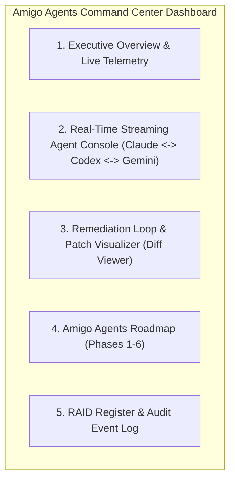

# GOAL-AMIGO-AGENTS-DASHBOARD-001

## Amigo Agents Command Center & Real-Time Agent Stream Dashboard
**Target Repository:** `C:\Users\JarvisRichardson\Desktop\SDD\Amigos-Agents` (`hanax-ai/Amigos-Agents`)
**Context:** **EXISTING REPOSITORY & ACTIVE HARNESS.** This goal specifies a dashboard extension for an already-built, multi-agent CLI harness and Python execution engine.
**Design Engine:** Lovable AI / React + Shadcn UI + Tailwind CSS
**Status:** Draft Specification & Lovable AI Execution Directive
**Authority:** This goal authorizes specification, UX design, and dashboard scaffolding for Lovable AI. Implementation shall preserve existing repository architecture and zero-contamination isolation rules.

---

## 1. Goal

Design, build, validate, and prepare for deployment a high-aesthetics, real-time web dashboard for **Amigo Agents** that provides a live command-and-control visual interface across the three core agent personas:

1. **Claude (The Researcher / Synthesizer - Anthropic)**
2. **Codex (The Builder - OpenAI)**
3. **Gemini (The Gatekeeper / QA Auditor - Google)**

The dashboard shall feature **Real-Time Streaming Agent Interactions**, displaying live prompt/response flows, in-memory diff patch proposals, gatekeeper review findings, and 3-round remediation loop status, alongside a Program Roadmap (Phases 1–6) and RAID Management register.

---

## 2. Preconditions & Existing Project Context

> [!IMPORTANT]
> **LOVABLE AI / BUILDER DIRECTIVE — EXISTING PROJECT NOTICE:**
> Lovable AI must recognize that **Amigo Agents is an existing, functional Python/CLI harness** with established code, tests, and configuration:
> - **Harness Core:** `harness/runner.py`, `harness/remediation_loop.py`, `harness/llm_clients.py`, `harness/evidence_collector.py`, `harness/config.py`
> - **Agent Definitions:** `agents/researcher.py`, `agents/builder.py`, `agents/gatekeeper.py`
> - **Tool Adapters:** `tools/git_adapter.py`, `tools/linter_adapter.py`
> - **Execution Log Directory:** `logs/<timestamp>_<slug>.json`
> - **Propose-Only Model:** Amigo Agents **never** mutates target repositories automatically; it generates in-memory diff patches for human hand-application.

---

## 3. Core Required Dashboard Views

### 3.1 Real-Time Streaming Agent Console (Primary Feature)
Provide a live, high-aesthetics streaming workspace terminal displaying real-time multi-agent collaboration:

* **Live Event Stream:** Stream agent-to-agent messages (WebSocket / EventSource SSE / log file tailing from `logs/`).
* **Role-Specific Color Coding & Icons:**
  * 🧠 **Claude (Researcher):** Spec analysis, evidence ingestion, research notes (Purple accent).
  * ⚡ **Codex (Builder):** Proposed text diff patch generation (Green/Emerald accent).
  * 🛡️ **Gemini (Gatekeeper):** Quality gate audit, security checks, finding lists (Blue/Cyan accent).
* **Live Step-by-Step State Matrix:** Shows current active stage (`Collecting Evidence` $\rightarrow$ `Researching` $\rightarrow$ `Round N Builder Patch` $\rightarrow$ `Round N Gatekeeper Audit` $\rightarrow$ `PASS / UNRESOLVED`).
* **Token & Latency Counter:** Live display of per-agent API model calls, token usage, and elapsed execution time.

### 3.2 In-Memory Diff & Patch Visualizer
* **Side-by-Side & Unified Diff Viewer:** Render syntax-highlighted text diff patches generated by the Builder agent.
* **Gatekeeper Annotations:** Overlay Gemini's review findings (`findings: list[str]`) directly onto the corresponding diff lines.
* **One-Click Copy & Export:** Allow developers to easily copy the verified patch for manual hand-application.

### 3.3 Executive Overview & Health Matrix
* Overall multi-agent harness execution status.
* Success vs. Unresolved remediation rate across all runs.
* API health status for Anthropic, OpenAI, and Google Gemini endpoints.
* Active target directory path indicator (`AMIGO_TARGET_DIR`).

### 3.4 Amigo Agents Roadmap View (Phases 1–6)
Interactive progress tracker across the 6 Amigo Agents phases:
- **Phase 1:** Harness Foundation & Infrastructure (`COMPLETE`)
- **Phase 2:** Tool Adapters & Safety Isolation (`COMPLETE`)
- **Phase 3:** Evidence Collection Engine (`COMPLETE`)
- **Phase 4:** Multi-Agent Collaboration Engine (`COMPLETE / MOCKED & LIVE VERIFIED`)
- **Phase 5:** Terminal UI & Streaming Command Center (`IN PROGRESS / THIS GOAL`)
- **Phase 6:** Verification Harness & CI Suite (`UPCOMING`)

### 3.5 RAID Register & Audit History
* Filterable register for Risks, Assumptions, Issues, and Dependencies.
* Complete immutable log transcript history loaded from `logs/<timestamp>_<slug>.json`.

---

## 4. Architectural & Data Authority Rules

1. **Zero-Contamination Boundary:** The dashboard must respect Amigo Agents' strict "propose-only" safety model. It shall not automatically force git commits or file writes on target repositories without explicit user authorization.
2. **Existing Log Ingestion:** The dashboard backend shall read execution transcripts directly from `logs/*.json` and stream active stdout events from `harness/runner.py`.
3. **Tech Stack:** Build using modern React / Vite / Next.js with **Shadcn UI**, **Tailwind CSS**, and **Framer Motion** for smooth micro-animations, glassmorphism aesthetics, and dark-mode optimization.

---

## 5. Minimum Acceptance Criteria for Lovable AI

1. **Recognizes Existing Project:** Seamlessly integrates with `Amigos-Agents` without overwriting existing Python harness files or git configuration.
2. **Real-Time Agent Streaming:** Renders live, color-coded stream cards for Claude, Codex, and Gemini interactions during execution cycles.
3. **Interactive Diff Visualizer:** Displays Builder diff patches with syntax highlighting and Gatekeeper finding annotations.
4. **Phase 1–6 Roadmap Tracking:** Accurately reflects Phase 4 completion and Phase 5 development status.
5. **High Aesthetics:** Modern dark-mode UI with rich typography (Inter/Roboto), smooth status pills, and responsive layout.

---

## 6. Required Deliverables for Lovable AI

* Visual React Component Architecture (`src/components/dashboard/`)
* Streaming Console Component (`src/components/streaming/AgentStreamConsole.tsx`)
* Diff Viewer Component (`src/components/diff/PatchDiffViewer.tsx`)
* Roadmap & RAID Register Views
* Integration guide for connecting `harness/runner.py` output streams to the UI.

---
*Goal specified by Gemini for Amigo Agents Command Center. Ready for Lovable AI design execution.*
