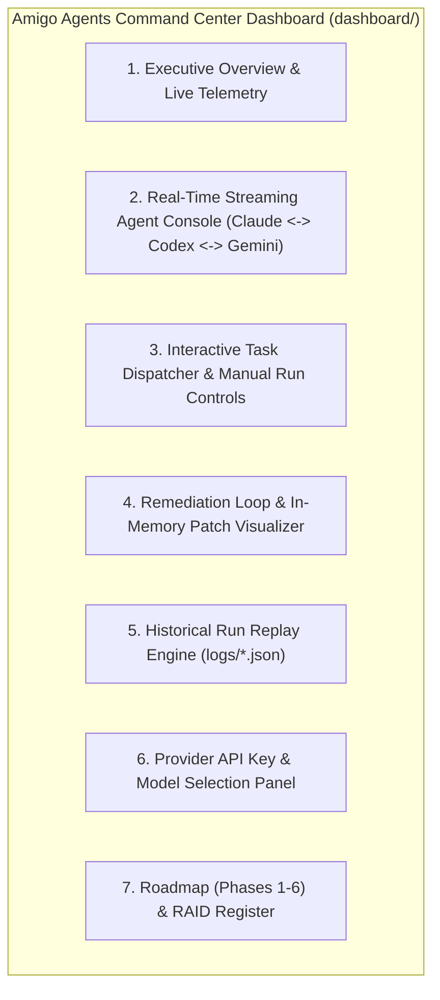

# GOAL-AMIGO-AGENTS-DASHBOARD-001

## Amigo Agents Command Center & Real-Time Agent Stream Dashboard
**Target Repository:** `C:\Users\JarvisRichardson\Desktop\SDD\Amigos-Agents` (`hanax-ai/Amigos-Agents`)
**Target Dashboard Location:** `C:\Users\JarvisRichardson\Desktop\SDD\Amigos-Agents\dashboard\`
**Context:** **EXISTING REPOSITORY & ACTIVE HARNESS.** This goal specifies a web dashboard extension for an already-built, multi-agent CLI harness and Python execution engine.
**Design Engine:** Lovable AI / React + Vite + Shadcn UI + Tailwind CSS
**Status:** Approved Specification & Lovable AI Execution Directive
**Authority:** This goal authorizes specification, UX design, and dashboard scaffolding for Lovable AI. Implementation shall preserve existing repository architecture and zero-contamination isolation rules.

---

## 1. Goal

Design, build, validate, and prepare for deployment a high-aesthetics, real-time web dashboard for **Amigo Agents** located under `dashboard/` inside the existing repository workspace. 

The dashboard provides a live command-and-control visual interface across the three core agent personas:

1. **Claude (The Researcher / Synthesizer - Anthropic)**
2. **Codex (The Builder - OpenAI)**
3. **Gemini (The Gatekeeper / QA Auditor - Google)**

The dashboard features **Real-Time Streaming Agent Interactions**, live task dispatching, in-memory diff patch visualizer, historical execution replay, provider model settings, alongside a Program Roadmap (Phases 1–6) and RAID Management register.

---

## 2. Preconditions & Existing Project Context

> [!IMPORTANT]
> **LOVABLE AI / BUILDER DIRECTIVE — EXISTING PROJECT NOTICE:**
> Lovable AI must recognize that **Amigo Agents is an existing, functional Python/CLI harness** with established code, tests, and configuration:
> - **Dashboard Location:** Create all web application code in `C:\Users\JarvisRichardson\Desktop\SDD\Amigos-Agents\dashboard\`.
> - **Harness Core:** `harness/runner.py`, `harness/remediation_loop.py`, `harness/llm_clients.py`, `harness/evidence_collector.py`, `harness/config.py`
> - **Agent Definitions:** `agents/researcher.py`, `agents/builder.py`, `agents/gatekeeper.py`
> - **Tool Adapters:** `tools/git_adapter.py`, `tools/linter_adapter.py`
> - **Execution Log Directory:** `logs/<timestamp>_<slug>.json`
> - **Propose-Only Model:** Amigo Agents **never** mutates target repositories automatically; it generates in-memory diff patches for human hand-application.

---

## 3. Core Required Dashboard Views & Specifications

### 3.1 Real-Time Streaming Agent Console (Primary Feature)
Provide a live, high-aesthetics streaming workspace terminal displaying real-time multi-agent collaboration:

* **Live Event Stream (`GET /api/stream` SSE / WebSocket):** Streams agent-to-agent messages, active prompts, and execution log updates from `logs/`.
* **Role-Specific Visual Themes:**
  * 🧠 **Claude (Researcher):** Spec analysis, evidence ingestion, research notes (Purple accent `#a855f7`).
  * ⚡ **Codex (Builder):** Proposed text diff patch generation (Green/Emerald accent `#10b981`).
  * 🛡️ **Gemini (Gatekeeper):** Quality gate audit, security checks, finding lists (Blue/Cyan accent `#06b6d4`).
* **Live Step-by-Step State Matrix:** Shows current active stage (`Collecting Evidence` $\rightarrow$ `Researching` $\rightarrow$ `Round N Builder Patch` $\rightarrow$ `Round N Gatekeeper Audit` $\rightarrow$ `PASS / UNRESOLVED`).
* **Token & Latency Metrics:** Real-time display of model invocation count, token usage, and elapsed execution time.

### 3.2 Interactive Task Dispatcher & Run Controls
Allow developers to initiate new Amigo Agents execution runs directly from the web interface:

* **Task Input Form (`POST /api/run-task`):**
  * Task description input field (e.g. *"Refactor auth module and fix race condition"*).
  * Target directory selector (`AMIGO_TARGET_DIR` default: `C:\Users\JarvisRichardson\Desktop\WiP\SDD-Core-Framework-Analysis`).
  * Max remediation rounds slider (Default: `3`).
* **Run Control Actions:** `Start Run`, `Cancel Execution`, and `Clear Terminal Stream`.

### 3.3 In-Memory Diff & Patch Visualizer
* **Side-by-Side & Unified Diff Viewer:** Render syntax-highlighted text diff patches generated by the Builder agent.
* **Gatekeeper Annotations:** Overlay Gemini's review findings (`findings: list[str]`) directly onto the corresponding diff lines.
* **One-Click Copy & Export:** Easy one-click patch copy for manual hand-application.

### 3.4 Historical Run Replay Engine
* **Transcript Log Browser:** List past execution logs from `logs/<timestamp>_<slug>.json`.
* **Step-by-Step Replay Controller:** Replay past multi-agent runs step-by-step with play, pause, and speed controls (`1x`, `2x`, `5x`).

### 3.5 Provider API Key & Model Selection Panel
* **API Key Presence Status:** Visual indicators showing `ANTHROPIC_API_KEY`, `OPENAI_API_KEY`, and `GEMINI_API_KEY` status.
* **Model Overrides:** Dropdown selection for active model environment bindings (`ANTHROPIC_MODEL`, `OPENAI_MODEL`, `GEMINI_MODEL`).

### 3.6 Amigo Agents Roadmap (Phases 1–6) & RAID Register
* **Roadmap Phase Tracker:**
  - **Phase 1:** Harness Foundation (`COMPLETE`)
  - **Phase 2:** Tool Adapters & Safety Isolation (`COMPLETE`)
  - **Phase 3:** Evidence Collection Engine (`COMPLETE`)
  - **Phase 4:** Multi-Agent Collaboration Engine (`COMPLETE / MOCKED & LIVE VERIFIED`)
  - **Phase 5:** Terminal UI & Streaming Command Center (`IN PROGRESS / THIS GOAL`)
  - **Phase 6:** Verification Harness & CI Suite (`UPCOMING`)
* **RAID Register:** Filterable register for Risks, Assumptions, Issues, and Dependencies.

---

## 4. Technical Architecture & Integration Rules

1. **Dashboard Location:** All frontend code must reside under `C:\Users\JarvisRichardson\Desktop\SDD\Amigos-Agents\dashboard\`.
2. **Bridge Protocol:** The dashboard communicates with the Python harness via lightweight REST/SSE endpoints (`GET /api/stream`, `POST /api/run-task`, `GET /api/logs`).
3. **Zero-Contamination Safety:** Preserves strict "propose-only" isolation. The dashboard never mutates target repository files automatically.
4. **Design System:** Built using React, Vite, **Shadcn UI**, **Tailwind CSS**, and **Framer Motion** for dark-mode glassmorphism aesthetics.

---

## 5. Minimum Acceptance Criteria for Lovable AI

1. **Recognizes Existing Repo:** Created strictly inside `Amigos-Agents/dashboard/` without modifying core Python harness files.
2. **Real-Time Agent Streaming:** Renders live, color-coded stream cards for Claude, Codex, and Gemini.
3. **Task Dispatcher:** Enables starting a run via `POST /api/run-task`.
4. **Interactive Diff Visualizer:** Displays Builder diff patches with syntax highlighting and Gatekeeper finding annotations.
5. **Historical Replay:** Loads past JSON transcripts from `logs/`.
6. **High Aesthetics:** Modern dark-mode UI with rich typography, smooth status pills, and responsive layout.

---
*Goal updated and completed by Gemini for Amigo Agents Command Center. Ready for Lovable AI execution.*
