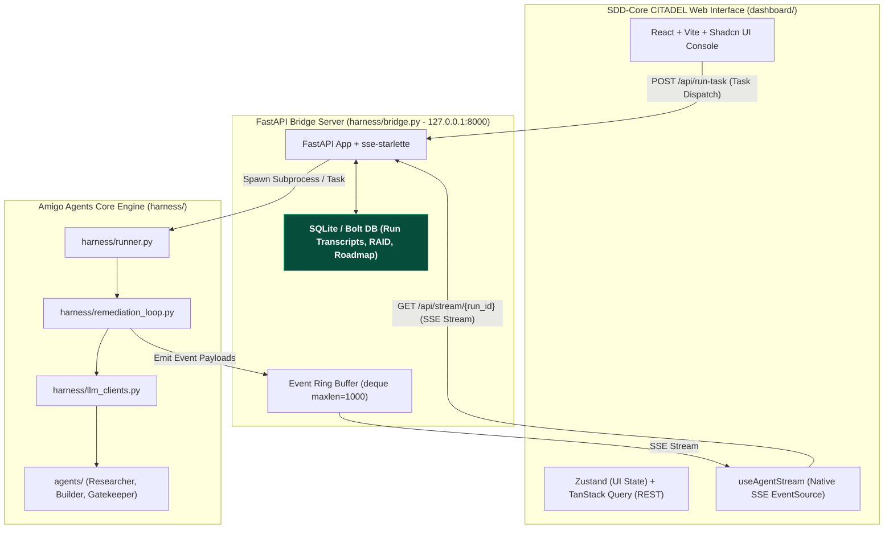

# GOAL-AMIGO-AGENTS-DASHBOARD-001

## SDD-Core CITADEL — Amigo Agents Command Center & Real-Time Stream Dashboard
**Official Dashboard Name:** **SDD-Core CITADEL**
**Target Repository:** `C:\Users\JarvisRichardson\Desktop\SDD\Amigos-Agents` (`hanax-ai/Amigos-Agents`)
**Target Dashboard Location:** `C:\Users\JarvisRichardson\Desktop\SDD\Amigos-Agents\dashboard\`
**Bridge Server Implementation:** `C:\Users\JarvisRichardson\Desktop\SDD\Amigos-Agents\harness\bridge.py` (FastAPI + `sse-starlette`)
**Context:** **EXISTING REPOSITORY & ACTIVE HARNESS.** This goal specifies a complete production dashboard and bridge extension for an already-built multi-agent Python execution engine.
**Design Stack:** React + Vite + TypeScript + Shadcn UI + Tailwind CSS + Zustand + TanStack Query + Framer Motion
**Status:** Approved Master Specification & Lovable AI / Builder Execution Directive
**Authority:** This goal authorizes the specification, UX design, bridge server implementation, and dashboard scaffolding. Implementation shall preserve existing repository architecture and zero-contamination isolation rules.

---

## 1. Goal & Architecture Overview

Design, build, validate, and prepare for deployment **SDD-Core CITADEL**—a high-aesthetics, real-time command-and-control dashboard located under `dashboard/` in the existing repository workspace, powered by a dedicated Python **FastAPI + `sse-starlette`** bridge server (`harness/bridge.py`).

SDD-Core CITADEL provides a unified visual control surface across the three core agent personas:

1. **Claude (The Researcher / Synthesizer - Anthropic)**
2. **Codex (The Builder / QA Red-Team - OpenAI)**
3. **Gemini (The Gatekeeper / Quality Auditor - Google)**



---

## 2. Preconditions & Existing Project Context

> [!IMPORTANT]
> **LOVABLE AI / BUILDER DIRECTIVE — EXISTING PROJECT NOTICE:**
> Lovable AI and project builders must recognize that **Amigo Agents is an existing, functional Python/CLI harness** with established code, tests, and configuration:
> - **Dashboard Location:** All web frontend code must be created under `C:\Users\JarvisRichardson\Desktop\SDD\Amigos-Agents\dashboard\`.
> - **Bridge Server Location:** The backend bridge server must be implemented at `C:\Users\JarvisRichardson\Desktop\SDD\Amigos-Agents\harness\bridge.py`.
> - **Harness Core:** `harness/runner.py`, `harness/remediation_loop.py`, `harness/llm_clients.py`, `harness/evidence_collector.py`, `harness/config.py`
> - **Agent Definitions:** `agents/researcher.py`, `agents/builder.py`, `agents/gatekeeper.py`
> - **Execution Log Directory:** `logs/<timestamp>_<slug>.json`
> - **Propose-Only Model:** Amigo Agents **never** mutates target repositories automatically; it generates in-memory diff patches for human hand-application.

---

## 3. Bridge Server Specification (`harness/bridge.py`)

### 3.1 Framework & Ownership
- **Framework:** **FastAPI + `sse-starlette`** running on `127.0.0.1:8000`.
- **Ownership:** `harness/bridge.py` is **in-scope** for this goal and must be delivered alongside the frontend.
- **Process Model:** The bridge server runs as an independent daemon. When a run is dispatched via `POST /api/run-task`, the bridge executes `harness/remediation_loop.py` asynchronously via `asyncio.create_task()`, streaming live event payloads into a thread-safe ring buffer (`collections.deque(maxlen=1000)`).

### 3.2 Strict API Contract & JSON Schemas

#### 1. Dispatch Task Endpoint: `POST /api/run-task`
**Request Body:**
```json
{
  "task": "Refactor auth pipeline and fix race conditions",
  "target_dir": "C:\\Users\\JarvisRichardson\\Desktop\\WiP\\SDD-Core-Framework-Analysis",
  "max_rounds": 3
}
```

**Response (202 Accepted):**
```json
{
  "run_id": "run_2026-07-30_213900_a1b2c3",
  "status": "started",
  "timestamp": "2026-07-30T21:39:00Z"
}
```

#### 2. Real-Time Stream Endpoint: `GET /api/stream/{run_id}`
Connects via Server-Sent Events (SSE). Reconnection headers (`Last-Event-ID`) are supported for seamless event replay from the ring buffer.

**SSE Event Schema Types:**

* **`event: stage_change`**
  ```json
  {"run_id": "run_123", "stage": "RESEARCHING", "agent": "Researcher", "timestamp": "2026-07-30T21:39:05Z"}
  ```

* **`event: agent_message`**
  ```json
  {"run_id": "run_123", "agent": "Builder", "round": 1, "message_type": "PATCH_PROPOSED", "content": "--- a/auth.py\n+++ b/auth.py\n@@ -10,3 +10,4 @@...", "timestamp": "2026-07-30T21:39:12Z"}
  ```

* **`event: token_metric`**
  ```json
  {"run_id": "run_123", "agent": "Gatekeeper", "tokens_used": 1420, "elapsed_ms": 3200, "timestamp": "2026-07-30T21:39:18Z"}
  ```

* **`event: run_complete`**
  ```json
  {"run_id": "run_123", "verdict": "PASS", "rounds_total": 1, "patch_text": "...", "timestamp": "2026-07-30T21:39:25Z"}
  ```

* **`event: error`**
  ```json
  {"run_id": "run_123", "error_code": "ERR_OPENAI_CREDITS_EXHAUSTED", "message": "OpenAI API returned 429 Insufficient Quota", "timestamp": "2026-07-30T21:39:26Z"}
  ```

#### 3. Log History Endpoint: `GET /api/logs`
Returns historical run list from disk/database (`[{ "run_id": "...", "task": "...", "verdict": "PASS", "created_at": "..." }]`).

#### 4. System & Key Status Endpoint: `GET /api/system/status`
Returns boolean key presence and active model names:
```json
{
  "anthropic_key_present": true,
  "openai_key_present": true,
  "gemini_key_present": true,
  "anthropic_model": "claude-3-5-sonnet-20241022",
  "openai_model": "gpt-4o",
  "gemini_model": "gemini-2.0-flash"
}
```

---

## 4. Security & Safety Invariants

> [!CAUTION]
> **CRITICAL SECURITY & ISOLATION CONSTRAINTS:**
> 1. **Secret Isolation:** Plaintext API key values (`ANTHROPIC_API_KEY`, `OPENAI_API_KEY`, `GEMINI_API_KEY`) shall **NEVER** be sent over the REST or SSE network boundary to the browser. The frontend receives boolean presence flags (`true`/`false`) and model name strings only.
> 2. **Localhost Binding:** The FastAPI bridge binds strictly to `127.0.0.1:8000` (loopback only). Remote cross-network interfaces are disabled by default.
> 3. **Boundary Enforced Propose-Only Model:** The bridge inspects all harness outputs. If any harness payload attempts direct filesystem writes on `target_dir`, the bridge rejects the operation and terminates the run. Diff patches are returned strictly as text payloads.

---

## 5. Core Dashboard Views & Visual Design

### 5.1 Real-Time Streaming Console & Stage Tracker
- **Agent Themes & Contrast Guidelines (WCAG AA Compliant):**
  - 🧠 **Claude (Researcher):** Purple accent (`#a855f7` for borders/badges; white text on dark cards).
  - ⚡ **Codex (Builder):** Emerald accent (`#10b981` for borders/badges).
  - 🛡️ **Gemini (Gatekeeper):** Cyan accent (`#06b6d4` for borders/badges).
- **Stage Tracker Pill Bar:** Displays live execution steps (`COLLECTING_EVIDENCE` $\rightarrow$ `RESEARCHING` $\rightarrow$ `BUILDER_PATCH_R1` $\rightarrow$ `GATEKEEPER_AUDIT_R1` $\rightarrow$ `VERDICT`).
- **Framer Motion Rules:** Animated entrances for new stream cards and stage transitions only. Motion is **explicitly forbidden** on code diff text streams to ensure unhindered reading.

### 5.2 In-Memory Diff & Patch Visualizer
- Side-by-side and unified diff viewer using Monaco Editor or Prism.js syntax highlighting.
- Overlay Gemini review findings (`findings: list[str]`) directly onto affected line ranges with colored warning badges.

### 5.3 Deterministic Historical Replay Engine
- Loads past execution logs from `logs/<timestamp>_<slug>.json` or SQLite.
- Replays past multi-agent runs deterministically from the stored JSON event transcript (no re-invocations of live models).
- Replay controls: Play, Pause, Scrubber Slider, and Speed Select (`1x`, `2x`, `5x`).

### 5.4 RAID Register View & Schema
Stores program Risks, Assumptions, Issues, and Dependencies in SQLite.
- **RAID Entity Fields:** `id`, `type` (`RISK`|`ASSUMPTION`|`ISSUE`|`DEPENDENCY`), `title`, `description`, `status` (`OPEN`|`TRIAGED`|`ASSIGNED`|`CLOSED`), `owner`, `phase`, `created_at`, `updated_at`.

### 5.5 Comprehensive UX Resilience (Empty, Loading & Error States)
- **No Runs Yet:** Clean empty state illustration with a prominent *"Dispatch First Task"* button.
- **Disconnected Stream:** Banner notification with auto-reconnecting countdown indicator (`Reconnecting in 3s...`).
- **Missing API Key Warning:** Warning banner highlighting missing provider keys before task dispatch.

---

## 6. Frontend Stack & State Management Strategy

- **Core Framework:** React + TypeScript + Vite (`dashboard/`).
- **UI & Styling:** Shadcn UI + Tailwind CSS (Dark Glassmorphism aesthetic).
- **State Management:**
  - **Zustand (`useUIStore`):** Active view selection, theme, drawer state, replay playback speed.
  - **TanStack Query (`useQuery` / `useMutation`):** REST API calls (`POST /api/run-task`, `GET /api/logs`, `GET /api/system/status`).
  - **Custom SSE Hook (`useAgentStream`):** Native `EventSource` connection with `Last-Event-ID` resume and ring-buffer syncing.

---

## 7. Serving Model & Proxy Configuration

To avoid CORS friction during development:
- **Dev Mode:** Vite runs on `http://localhost:5173` with proxy configuration in `vite.config.ts`:
  ```typescript
  export default defineConfig({
    server: {
      proxy: {
        '/api': 'http://127.0.0.1:8000'
      }
    }
  })
  ```
- **Production Mode:** FastAPI serves the compiled static React build from `dashboard/dist/` directly on `http://127.0.0.1:8000`.

---

## 8. Minimum Acceptance Criteria for Lovable AI

1. **Dashboard Location:** Built strictly inside `C:\Users\JarvisRichardson\Desktop\SDD\Amigos-Agents\dashboard\`.
2. **Bridge Integration:** `harness/bridge.py` starts cleanly and handles `POST /api/run-task` and `GET /api/stream/{run_id}`.
3. **Real-Time Streaming:** Live SSE card streams render correctly for Claude, Codex, and Gemini with WCAG AA contrast.
4. **Patch Visualizer:** Renders syntax-highlighted diffs with Gemini audit annotations.
5. **Deterministic Replay:** Accurately replays transcripts from `logs/*.json`.
6. **Secret Safety:** API keys are never exposed in REST/SSE payloads.

---
*Master Specification approved for SDD-Core CITADEL Dashboard. Ready for Lovable AI execution.*
