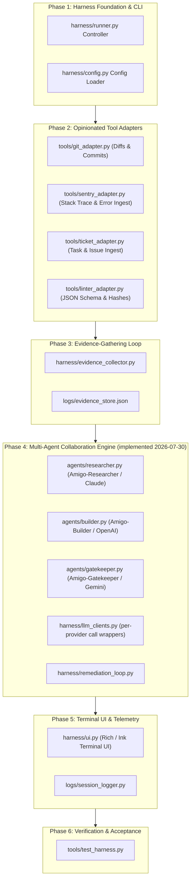

# 🚀 Amigo Agents Harness — Implementation Plan

> **Goal:** Build and deploy the **Amigo Agents Multi-Agent Collaboration Harness** based on the AI harness design principles demonstrated by Claire Vo (*"What is an AI harness? I build one live in less than 30 minutes"*), tailored for automated code authoring, substantive gatekeeper reviews, and zero-contamination target codebase auditing.

---

## 📋 Prerequisites & Environment Setup

Before starting implementation, ensure the following prerequisites are installed and configured:

### 1. Host Infrastructure & Runtimes
- [ ] **Python 3.12+** (for harness controller `harness/runner.py` and validator tools).
- [ ] **Node.js v20+** & `npm` / `pnpm` (optional, for Ink terminal UI rendering).
- [ ] **Git 2.40+** (installed and available on system PATH).

### 2. Environment Variables & API Keys
- [ ] **`ANTHROPIC_API_KEY`** (for Claude Code / Amigo-Researcher).
- [ ] **`GEMINI_API_KEY`** or Google Antigravity environment (for Amigo-Gatekeeper reviewer).
- [ ] **`OPENAI_API_KEY`** (optional, for Codex / Amigo-Builder).

### 3. Target Workspace Bindings
- [ ] Read/Write access to target project directory: `C:\Users\JarvisRichardson\Desktop\WiP\SDD-Core-Framework-Analysis\`.
- [ ] Isolated working directory: `C:\Users\JarvisRichardson\Desktop\SDD\Amigos-Agents\`.

---

## 🏗️ Architecture & Component Roadmap

---

## 📑 Proposed Implementation Tasks

### Task 1: Bootstrap Harness Foundation & Configuration (`Phase 1`)
- [ ] Create `harness/config.py` to parse project settings, API keys, target workspace paths, and log destinations.
- [ ] Create `harness/runner.py` CLI controller supporting `--task`, `--target-dir`, and `--agent-mode` flags.
- [ ] Verify clean CLI startup and help output (`python harness/runner.py --help`).

### Task 2: Build Opinionated Tool Adapters (`Phase 2`)
- [ ] Implement `tools/git_adapter.py` to extract git diffs, modified file lists, and working tree status without altering git history.
- [ ] Implement `tools/sentry_adapter.py` / error log parser to ingest raw tracebacks, error codes, and exception details.
- [ ] Implement `tools/linter_adapter.py` to run Draft 2020-12 JSON Schema validation and SHA-256 file table recomputations.
- [ ] Verify adapter outputs return clean structured JSON payloads.

### Task 3: Implement Evidence-Gathering Loop (`Phase 3`)
- [ ] Create `harness/evidence_collector.py` to force the harness to gather file lines, git diffs, error tracebacks, and schema rules BEFORE invoking LLMs.
- [ ] Store structured evidence payloads in `logs/evidence_store.json`.
- [ ] Verify that no code fix is attempted without complete evidence collection.

### Task 4: Construct Multi-Agent Implementer-Reviewer Engine (`Phase 4`) — ✅ Implemented 2026-07-30
- [x] Implement `agents/builder.py` (Amigo-Builder, OpenAI) to generate diff patches. Propose-only — never writes files; a human applies the patch.
- [x] Implement `agents/gatekeeper.py` (`AmigoGatekeeper.review()`, Gemini) to perform substantive gate reviews of proposed patches; empty findings list = pass.
- [x] Implement `agents/researcher.py` (Amigo-Researcher, Claude) — not in the original task list, but required to complete the 3-agent roster documented in `.env.example`/`AGENTS.md`. Runs once per task before the remediation rounds start.
- [x] Implement `harness/llm_clients.py` — per-provider call wrappers with fail-fast API key checks, shared by all three agents.
- [x] Implement `harness/remediation_loop.py` to run Researcher once, then loop Builder → Gatekeeper for up to `MAX_ROUNDS = 3`, writing a full JSON transcript per run to `logs/`.
- [x] Verify automated fix loop cycles until 0 findings remain or max iterations are reached — covered by `tests/test_remediation_loop.py` (all LLM calls mocked; verifies pass-after-findings, max-round cutoff, and researcher-called-once behavior). See `docs/superpowers/specs/2026-07-30-phase4-multi-agent-engine-design.md` and `docs/superpowers/plans/2026-07-30-phase4-multi-agent-engine.md` for the full design/plan.
- [x] Verify against **real** provider APIs (not mocks) — completed 2026-07-30 across multiple live runs. All three providers confirmed working end-to-end; five real bugs found and fixed along the way that the mocked test suite couldn't catch:
  1. **Environment (not code):** this machine's antivirus (Norton) TLS-intercepts all HTTPS traffic with a locally-generated root CA that Python's `certifi` bundle doesn't trust by default. Fixed by installing `pip-system-certs` (uses the OS trust store instead). Not committed to this repo.
  2. **OpenAI/Builder:** `gpt-5.3-codex` isn't served by `chat.completions.create` (404) — needs `client.responses.create(model, instructions, input)`. Fixed, verified against the installed SDK's real method signature.
  3. **Error handling:** all three `call_*` functions in `harness/llm_clients.py` now catch each provider's root exception and re-raise a clear `RuntimeError` naming the failing agent, instead of a bare unattributed traceback.
  4. **Gemini/Gatekeeper:** `gemini-3.1-pro` doesn't exist (404); `gemini-3.1-pro-preview` and `gemini-2.5-pro` exist but this account's free tier has zero quota for any pro-tier model (confirmed across multiple models, all `limit: 0`). `gemini-flash-latest` is the only tier with real quota — confirmed with an actual successful call before committing.
  5. **Architecture gap:** Builder never received real file content (`focus_files` was always empty — dead code since Task 1), so it hallucinated surrounding context and produced syntactically broken patches (missing/placeholder values) that Gatekeeper correctly rejected. Fixed: `evidence_collector.py` now includes real file content per focus file (4000-char cap + truncation flag); `remediation_loop.py` extracts file-path-shaped tokens from the task description and resolves them against `target_dir` to populate `focus_files`. Builder now produces genuinely correct patches every round.
  - **Gemini model upgraded 2026-07-30:** `gemini-3.6-flash` + `thinking_config.thinking_level="HIGH"` (both confirmed real via live calls; `client.models.list()` is the reliable way to find what a given key can actually reach — don't hardcode a guessed model name). Ran the same demo task (document, don't fix, a known hardcoded path) against three configurations — original Gatekeeper prompt, scope-refined prompt, and this model+reasoning upgrade — and got the **same substantive objection nearly verbatim all three times**. That convergence means it isn't a weak-model artifact: Gatekeeper is consistently, correctly applying real code-quality judgment to a task shape that's inherently awkward for a reviewer ("we're deliberately not fixing this known bug"). Treat `UNRESOLVED` on that specific demo task as correct reviewer behavior, not a defect — Builder produces fully correct patches every round; Gatekeeper isn't wrong to want more.
  - **Not yet run:** a task with no adjacent pre-existing anti-pattern, to get a confirming clean `PASS` on record. Blocked as of 2026-07-30 21:5x by `gemini-3.6-flash`'s free-tier daily quota (20 requests/day) being exhausted from this session's testing — resets the next day, or needs Gemini billing enabled. Retry once available: `python harness/runner.py --task "Add a docstring to the _slugify function in harness/remediation_loop.py explaining that it converts a task description into a filesystem-safe slug for log filenames"`.

### Task 5: Build Terminal UI & Telemetry Logger (`Phase 5`)
- [ ] Implement `harness/ui.py` using Python `Rich` (or Node.js `Ink`) to display live progress bars, step-by-step agent turns, and color-coded review verdicts.
- [ ] Implement `logs/session_logger.py` to record full, un-truncated execution logs in `Amigos-Agents/logs/`.

### Task 6: End-to-End Verification & Integration Test (`Phase 6`)
- [ ] Create `tools/test_harness.py` to run a simulated bug-fix and code-review task against a mock target file.
- [ ] Verify end-to-end execution completes, passes all gate checks, and writes zero transient files into the target project.

---

## 🔍 Verification Plan

### Automated Tests
- [ ] `python tools/test_harness.py` — Verify end-to-end harness execution loop.
- [ ] `python tools/linter_adapter.py --check-all` — Verify schema linting and hash checking adapters.

### Manual Verification
- [x] Run sample task: `python harness/runner.py --task "<task description>"` (defaults to the target dir above). Completed 2026-07-30 across multiple live runs — see Task 4 status notes above for the full bug-fix trail.
- [x] Confirm execution logs are written to `Amigos-Agents/logs/` and target codebase manifests remain 100% untouched — confirmed: every run wrote a full JSON transcript to `logs/`, and propose-only means no run ever wrote to `target_dir`.
