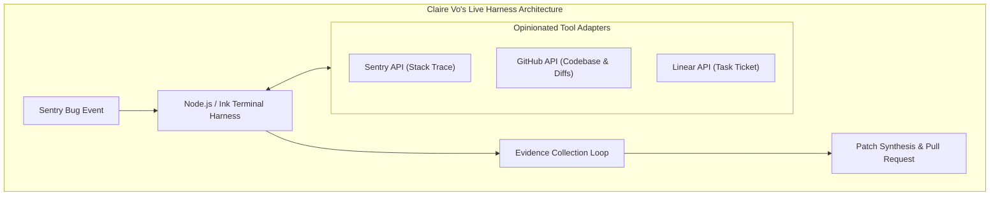

# 🔬 Amigo Agents Research Artifact — Claire Vo AI Harness Analysis

> **Topic:** Analysis of Claire Vo's AI Harness Design (*"What is an AI harness? I build one live in less than 30 minutes"*)  
> **Repository:** Amigo Agents (`C:\Users\JarvisRichardson\Desktop\SDD\Amigos-Agents\research\`)  
> **URL Reference:** [https://youtu.be/ofS-4RRw9zw](https://youtu.be/ofS-4RRw9zw)

---

## 1. Executive Summary & Core Research Findings

An **AI Harness** is a structured, opinionated execution wrapper surrounding an LLM or AI agent. Rather than relying on generic "chat" UI interactions, a harness constrains agent execution, forces evidence collection (stack traces, git diffs, file context), and manages task execution step-by-step.

---

## 2. Key Architectural Takeaways for Amigo Agents

1. **Chat UI vs. AI Harness:** Generic chat interfaces lack state boundaries and tool constraints. An AI harness provides a structured wrapper code around the LLM to execute specific, opinionated workflows.
2. **Evidence-Driven Execution:** The harness forces the agent to gather concrete evidence (stack traces, commit logs, environment details) before attempting code fixes.
3. **Opinionated Tool Adapters:** Instead of giving an agent generic web access, the harness exposes dedicated adapters to external tools (Git diffs, Sentry errors, schema linters).
4. **Terminal UI & Micro-Management:** Uses a terminal UI to provide real-time execution visibility and step-by-step progress tracking.

---

## 3. Mapping Claire Vo's Design to Amigo Agents Harness

| Harness Pattern | Claire Vo's Implementation | Amigo Agents Implementation |
| :--- | :--- | :--- |
| **Execution Framework** | Custom Node.js / Claude Agent SDK wrapper | **Python Harness Controller (`harness/runner.py`)** |
| **Tool Adapters** | Hardcoded Sentry, Linear & GitHub adapters | **Modular Adapters (`tools/git_adapter.py`, `tools/linter_adapter.py`)** |
| **Evidence Collection** | Sentry stack trace & diff inspection | **Evidence Collector (`harness/evidence_collector.py`)** |
| **Agent Collaboration** | Single agent worker | **Multi-Agent Loop (`agents/builder.py` + `agents/gatekeeper.py`)** |
| **Terminal Telemetry** | Ink terminal UI | **Rich Terminal Progress UI (`harness/ui.py`)** |
