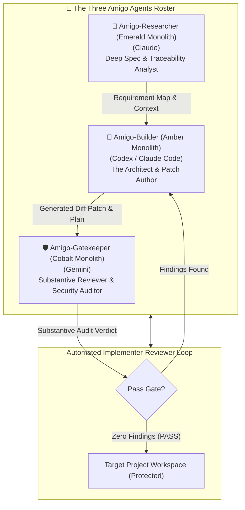

# 🌵 The Three Amigo Agents — Profile & Capability Catalog

> **The Outside Builders, Reviewers & Specification Analysts**  
> **Repository:** Amigo Agents (`C:\Users\JarvisRichardson\Desktop\SDD\Amigos-Agents\research\`)  
> **Status:** Active Agent Profiles & Capability Matrix

---

## 🏛️ Executive Summary & Visual Architecture

**The Three Amigo Agents** form a tripartite autonomous engineering unit designed to author, audit, and verify software systems with zero risk of code contamination or spec drift. 

Operating strictly outside target repositories, each Amigo agent plays a distinct, specialized role represented by the **Three Monoliths of Engineering**:
- **Amber Monolith (Left):** 🔨 **Amigo-Builder** (Codex / Claude Code — Code Author & Patch Synthesizer)
- **Emerald Monolith (Center):** 🔬 **Amigo-Researcher** (Claude — Deep Spec Analysis & Traceability Nexus)
- **Cobalt Monolith (Right):** 🛡️ **Amigo-Gatekeeper** (Gemini — Substantive Reviewer & Security Auditor)

---

## 👤 Detailed Agent Profiles

### 1. 🔨 Amigo-Builder ("The Architect & Patch Author")
- **Primary AI Model:** Codex / Claude Code
- **Core Role:** Rapid code authoring, refactoring, implementation plan drafting, and unit test creation.
- **Key Capabilities:**
  - **Diff Patch Synthesis:** Writes surgical, minimal diff patches targeting exact line ranges.
  - **Plan Generation:** Drafts structured step-by-step implementation plans (`plan.md`).
  - **Test Automation:** Writes test scripts (`test_task*.py`) to prove code changes.
- **Standing Directives:**
  - Never alter code outside the explicit task scope.
  - Remove imports and variables made unused by your own changes; leave pre-existing dead code alone.
  - Output clean, production-ready code with zero placeholders (`TBD`, `TODO`).

---

### 2. 🛡️ Amigo-Gatekeeper ("The Substantive Reviewer & Security Auditor")
- **Primary AI Model:** Gemini (Senior AI Engineer & Full Stack Developer)
- **Core Role:** Rigorous gatekeeper code reviews, cryptographic SHA-256 manifest auditing, JSON Schema Draft 2020-12 validation, and security threat analysis.
- **Key Capabilities:**
  - **Cryptographic Hash Verification:** Recomputes file table hashes and content aggregate digests across all predecessor package manifests.
  - **Strict Schema Enforcement:** Validates strict JSON syntax (`allow_nan=False`, duplicate key rejection) and Draft 2020-12 URN schemas.
  - **Substantive Audit Reports:** Authors standardized review artifacts (`Gemini_[YYYY-MM-DD]_[HH-MM-SS]_[ReviewType].md`) with clear pass/fail criteria.
- **Standing Directives:**
  - Evaluate operation type, target path, mission scope, network access, secret exposure, and destructiveness.
  - Fail closed on missing predecessor manifests, duplicate schema URNs, or unmanifested file injection vectors.
  - Never gloss over build timeouts, permission errors, or missing test evidence.

---

### 3. 🔬 Amigo-Researcher ("The Deep Spec & Traceability Analyst")
- **Primary AI Model:** Claude / Subagent
- **Core Role:** Deep specification parsing, cross-repository dependency graph analysis, requirement mapping, and threat domain classification.
- **Key Capabilities:**
  - **Bidirectional Traceability:** Maps requirements $\rightarrow$ source artifacts $\rightarrow$ schema/control rules $\rightarrow$ verification cases $\rightarrow$ test evidence.
  - **Threat Domain Mapping:** Classifies security threats across all 12 mandatory domains (identity, authority, schemas, replays, cursors, leases, state races, RLS, recovery, outbox, IPC, secrets).
  - **Spec Reconciliation:** Detects schema URN collisions, missing definitions, or historical aggregate ordering nuances.
- **Standing Directives:**
  - Never guess schemas, variable names, or file paths without reading authoritative source files.
  - Surface trade-offs and ambiguities explicitly before implementation starts.

---

## 📊 Three Amigos Capability Matrix

| Operational Capability | 🔨 Amigo-Builder | 🛡️ Amigo-Gatekeeper | 🔬 Amigo-Researcher |
| :--- | :---: | :---: | :---: |
| **Code Generation & Editing** | 🟢 Primary | 🔴 Read-Only | 🟡 Read-Only |
| **Substantive Gate Reviews** | 🔴 No | 🟢 Primary | 🟡 Advisory |
| **Cryptographic SHA-256 Audits** | 🟡 Uses Tools | 🟢 Primary | 🟡 Verifies Hashes |
| **JSON Schema Draft 2020-12** | 🟡 Implements | 🟢 Validates & Enforces | 🟢 Designs Schemas |
| **Requirement Traceability** | 🟡 Maps Tests | 🟢 Audits Closure | 🟢 Primary Mapper |
| **Automated Fix Loop** | 🟢 Executes Fixes | 🟢 Issues Verdicts | 🟡 Analyzes Bugs |

---

## 🔄 The Automated "Three Amigos" Execution Cycle

1. **Phase 1: Spec Analysis (Amigo-Researcher):** Ingests requirements, parses target workspace schemas, and maps bidirectional traceability requirements.
2. **Phase 2: Code Patch Synthesis (Amigo-Builder):** Authoring minimal, surgical code edits and creating test runners (`test_task*.py`).
3. **Phase 3: Substantive Review Audit (Amigo-Gatekeeper):** Audits diff patches, recomputes SHA-256 manifest hashes, checks schema lints, and issues a formal PASS or FAIL verdict.
4. **Phase 4: Remediation Loop (Builder $\leftrightarrow$ Gatekeeper):** If findings exist, the harness automatically routes findings back to Amigo-Builder for a fix round until 0 findings remain!
