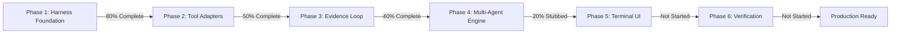

# 🤝 Amigo Agents — Comprehensive Project Review & Security Audit Report

**Project Name:** Amigo Agents (External Multi-Agent Collaboration & Review Harness)  
**Workspace Path:** `C:\Users\JarvisRichardson\Desktop\SDD\Amigos-Agents`  
**Target Repository:** `C:\Users\JarvisRichardson\Desktop\WiP\SDD-Core-Framework-Analysis`  
**Date:** 2026-07-30  
**Reviewer:** Amigo-Gatekeeper Audit Engine  

---

## 1. Executive Summary

**Amigo Agents** is an external multi-agent collaboration and code review harness. Inspired by AI harness design patterns, it orchestrates specialized AI agents—**Amigo-Builder** (Codex / Claude Code), **Amigo-Gatekeeper** (Gemini), and **Amigo-Researcher** (Claude)—to execute code authoring, evidence collection, substantive code reviews, and schema audits completely **decoupled** from governed target repositories.

This audit evaluated the harness repository across architecture alignment, tool adapter readiness, evidence loop integration, standing directives compliance, runtime compatibility, and security auditing of third-party skills.

---

## 2. Multi-Agent Roster & Role Mapping

The project documentation ([AMIGO_AGENTS_HARNESS_BLUEPRINT.md](../AMIGO_AGENTS_HARNESS_BLUEPRINT.md) and [THREE_AMIGO_AGENTS_PROFILES_AND_CAPABILITIES.md](../research/THREE_AMIGO_AGENTS_PROFILES_AND_CAPABILITIES.md)) establishes a clear role division:

| Agent | Target Model | Core Responsibilities | Current Implementation Status |
| :--- | :--- | :--- | :--- |
| **🔨 Amigo-Builder** | Codex / Claude Code | Rapid code patch authoring, implementation plans, unit test generation | Initial placeholder ([builder.json](../agents/builder.json)) |
| **🛡️ Amigo-Gatekeeper** | Gemini | Substantive reviews, cryptographic SHA-256 checks, JSON schema validation, security audits | Helper class present ([gatekeeper.py](../agents/gatekeeper.py)), missing `reviewer.json` profile |
| **🔬 Amigo-Researcher** | Claude | Requirement traceability, cross-repo dependency mapping, spec analysis | Missing `researcher.json` profile |

---

## 3. Implementation Audit & Roadmap Gap Analysis

Comparing the codebase against the 6-phase roadmap in [implementation_plan.md](../implementation_plan.md):

### Subsystem Breakdown:

1. **Harness Core (`harness/`):**
   - `config.py`: Environment loader & path resolver implemented.
   - `runner.py`: CLI interface implemented for `--task` and `--status` flags.
   - `evidence_collector.py`: Gathers git status, diffs, file sizes, syntax validity, and SHA-256 hashes before model execution.
   - `remediation_loop.py`: Currently stubbed; prints git status and returns a dict without executing multi-round agent fix loops.

2. **Tool Adapters (`tools/`):**
   - `git_adapter.py`: Working tree status and unified diff extractor implemented.
   - `linter_adapter.py`: SHA-256 hashing and strict JSON syntax validator (`parse_constant` check + duplicate key rejection) implemented.
   - **Missing Adapters:** `sentry_adapter.py` (for stack trace ingest) and `sha256_verifier.py` (referenced in [README.md](../README.md)).

---

## 4. Key Bugs & Deficiencies Identified

### 🚨 Bug 1: Windows Console Character Encoding Crash (Critical)
* **Location:** `harness/runner.py:L48`
* **Issue:** Execution of `python harness/runner.py --status` fails with `UnicodeEncodeError: 'charmap' codec can't encode character '\U0001f91d'` due to un-buffered Unicode Emojis (🤝, 🚀, 📂, ✨, 📊) printed under default Windows `cp1252` encoding.
* **Impact:** CLI crashes immediately on Windows terminals unless `PYTHONIOENCODING=utf-8` is configured.

### 🚨 Bug 2: WSL/Linux Hardcoded Path Incompatibility (Important)
* **Locations:** `harness/config.py:L25` and `tools/test_adapters.py:L17`
* **Issue:** Target directory paths are hardcoded as WSL Linux paths (`/mnt/c/Users/JarvisRichardson/Desktop/...`) instead of native Windows paths (`C:\Users\JarvisRichardson\Desktop\...`).
* **Impact:** On Windows native Python, `get_git_status()` fails with `[WinError 267] The directory name is invalid`.

### ⚠️ Bug 3: Incomplete Agent Profiles & Stubbed Remediation Loop (Important)
* **Locations:** `agents/builder.json`, `harness/remediation_loop.py`
* **Issue:** `builder.json` is a 25-byte placeholder (`{"name": "Amigo-Builder"}`). `reviewer.json` and `researcher.json` do not exist. `remediation_loop.py` does not dispatch LLM calls or run fix loops.

---

## 5. Directives & Standing Rules Compliance Audit

| Standing Directive Rule | Status | Audit Verdict |
| :--- | :---: | :--- |
| **Rule 1: Zero-Contamination Isolation** | 🟢 PASS | Amigo Agents operates completely outside target directories in its own root. Logs and transient artifacts are restricted to `Amigos-Agents/logs/`. |
| **Rule 2: Multi-Agent Role Clarity** | 🟢 PASS | Formally defined in `AGENTS.md` and blueprint artifacts. |
| **Rule 3: Automated Remediation Loop** | 🟡 PARTIAL | Framework planned; loop dispatcher requires active LLM execution logic. |
| **Rule 4: Production-Quality Output Standards** | 🟢 PASS | Existing code adapters have complete type annotations, docstrings, and error handling. |

---

## 6. Third-Party Skills Security Audit & Vetting Matrix

A deep security audit of third-party repositories from `awesomeclaude.ai/awesome-claude-skills` yielded the following safety verdicts:

| Repository / Skill | Safety Verdict | Technical Audit Finding & Risk | Action Taken |
| :--- | :---: | :--- | :--- |
| **`imbue-ai/blueprint`** | ⚠️ Caution (Approved with Manual Clone) | Pure markdown skill. Safe if cloned directly via `git clone`. Avoid piping docs install script to `bash`. | **APPROVED** (Manual `git clone` only) |
| **`obra/superpowers`** | ✅ Safe (Redundant) | Pure markdown / active skills. Redundant as it is already active in current session. | **EXCLUDED** (Redundant) |
| **`avifenesh/agnix`** | ⚠️ Caution (Binary Tool) | Compiled Rust CLI/LSP binary downloaded via `npm postinstall`. Not a pure markdown skill. | **EXCLUDED** (Unsigned Binary) |
| **`AlmogBaku/debug-skill`** | ⚠️ Caution (Binary Tool) | Compiled Go binary interactive debugger attaching to live processes via unsigned installer. | **EXCLUDED** (Unsigned Binary) |
| **`luoyuctl/agenttrace`** | ⚠️ Caution (Binary Tool) | Compiled Rust CLI reading session logs. SKILL.md is a thin wrapper around executable binary. | **EXCLUDED** (Unsigned Binary) |
| **`raphaelchristi/harness-evolver`** | ❌ **UNSAFE** | Autonomous agent that rewrites code and auto-merges without review; stores API keys on disk. | **EXCLUDED** (Security Threat) |

---

## 7. Actionable Remediation Plan

1. **Fix Windows Encoding & Path Handling:**
   - Configure `sys.stdout.reconfigure(encoding='utf-8')` in `runner.py`.
   - Update `DEFAULT_TARGET_DIR` in `config.py` to use `Path("C:/Users/JarvisRichardson/Desktop/WiP/SDD-Core-Framework-Analysis")`.
2. **Complete Agent Roster Profiles:**
   - Expand `agents/builder.json`, create `agents/reviewer.json` (Gemini), and `agents/researcher.json` (Claude).
3. **Build Out Multi-Agent Remediation Loop:**
   - Integrate `AmigoGatekeeper` in `remediation_loop.py` to evaluate evidence payloads and issue automated fix requests.
4. **Integrate Vetted Pure Markdown Skills Only:**
   - Use manual `git clone` for `imbue-ai/blueprint` under `.agents/skills/blueprint`. Avoid unsigned executable binaries.
