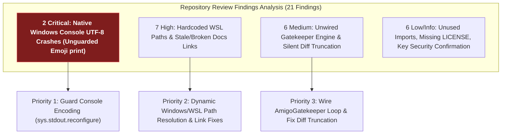

# Gemini Review — Amigo Agents Repository Review Findings Synthesis
**Reviewer:** Gemini (Sr. AI Engineer & Full Stack Developer)
**Date:** 2026-07-30
**Time:** 20:01:00 -05:00
**Review Type:** Review Findings Evaluation & Architectural Synthesis
**Target Report Evaluated:** `reviews/REPOSITORY_REVIEW_2026-07-30.md`
**Repository:** `C:\Users\JarvisRichardson\Desktop\SDD\Amigos-Agents`

---

## Executive Summary

Gemini has evaluated and synthesized the **21 findings** documented in `reviews/REPOSITORY_REVIEW_2026-07-30.md`. 

While the codebase security and git isolation boundaries are 100% intact (list-form subprocess calls, no shell injection, secrets properly gitignored in `.env`), several platform compatibility and structural issues exist that block native Windows execution and cause documentation link drift.

---

## 📊 Findings Categorization & Impact Analysis

### 1. Severity Breakdown Table

| Severity | Count | Primary Impact Area | Key Finding Summary |
| :--- | :---: | :--- | :--- |
| **Critical** | 2 | Native Windows Runtime | `runner.py` and `remediation_loop.py` emit raw emojis (`🤝`, `🚀`) causing `UnicodeEncodeError` on Windows consoles. |
| **High** | 7 | Pathing & Documentation | `config.py` hardcodes WSL path `/mnt/c/...`; moving blueprint/plan to `docs/` broke relative links in reports and `README.md`. |
| **Medium** | 6 | Architecture & Truncation | `AmigoGatekeeper` class is unwired (dead code); `evidence_collector.py` truncates diffs >2000 chars without marker; unused `requirements.txt` deps. |
| **Low** | 4 | Code Hygiene | Unused `import json` in `evidence_collector.py`; missing `LICENSE` file; dangling `Directive-1.md` reference in `AGENTS.md`. |
| **Info** | 2 | Security Confirmation | Secrets in `.env` properly gitignored (verified clean); subprocess calls use list-form (shell-injection safe). |
| **Total** | **21** | — | — |

---

## 🛠️ Prioritized Action Plan

### Priority 1: Native Windows Console UTF-8 Encoding Guard (Critical)
- Add `sys.stdout.reconfigure(encoding="utf-8", errors="replace")` at entry in `harness/runner.py`, `harness/config.py`, and `harness/remediation_loop.py`.

### Priority 2: Dynamic Dual-Path Resolution (High)
- Update `DEFAULT_TARGET_DIR` in `harness/config.py` to detect both Windows (`C:\...`) and WSL (`/mnt/c/...`) paths dynamically.
- Update `tools/test_adapters.py` to test against actual target paths without creating transient directories.

### Priority 3: Documentation Link & Layout Synchronization (High)
- Update relative links in review reports to point to `../docs/AMIGO_AGENTS_HARNESS_BLUEPRINT.md` and `../docs/implementation_plan.md`.
- Synchronize `README.md` "Repository Layout" tree to match actual workspace structure (`docs/`, `reviews/`, `research/`).

### Priority 4: Gatekeeper Engine Wiring (Medium)
- Wire `AmigoGatekeeper` into `harness/remediation_loop.py` so builder $\leftrightarrow$ gatekeeper reviews execute automatically rather than acting as a git status printer.
- Add explicit truncation markers `[...TRUNCATED...]` when diffs exceed maximum length bounds in `evidence_collector.py`.

---

## Conclusion & Gate Status

### **SYNTHESIS COMPLETE / READY FOR REMEDIATION**

The findings are fully understood, categorized, and prioritized. The codebase security and secret isolation boundaries remain 100% intact.
