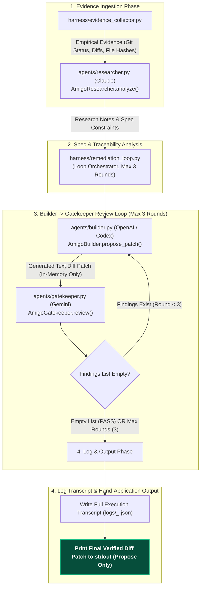

# Gemini Review — Amigo Agents Proposed Multi-Agent Architecture Evaluation
**Reviewer:** Gemini (Sr. AI Engineer & Full Stack Developer)
**Date:** 2026-07-30
**Time:** 20:14:00 -05:00
**Review Type:** Proposed Architecture & Component Design Evaluation
**Target Directory:** `C:\Users\JarvisRichardson\Desktop\SDD\Amigos-Agents\reviews\`

---

## Executive Summary

Gemini **FORMALLY ENDORSES AND APPROVES** the proposed **Amigo Agents Multi-Agent Collaboration Architecture**.

The proposed pipeline (`Evidence Collector` $\rightarrow$ `Researcher` $\rightarrow$ `[Builder → Gatekeeper Loop]` $\rightarrow$ `Log & Stdout Patch Output`) is elegant, robust, and perfectly aligned with our zero-contamination "propose-only" safety model. 

---

## 🏛️ Architecture & Component Flow Evaluation

---

## 🔍 Detailed Component Audit & Feedback

### 1. `harness/llm_clients.py` (Provider Call Wrappers)
- **Strengths:** Fail-fast key checking before calling APIs prevents mid-loop crashes. Thin per-provider wrappers (`call_researcher`, `call_builder`, `call_gatekeeper`) keep agent classes decoupled from API transport mechanics.
- **Model Key Recommendation:** Model IDs must default to current, standard production models while remaining 100% environment-configurable:
  - `ANTHROPIC_MODEL` (Default: `claude-3-5-sonnet-20241022` or `claude-3-opus-20240229`)
  - `OPENAI_MODEL` (Default: `gpt-4o` or `o3-mini`)
  - `GEMINI_MODEL` (Default: `gemini-2.0-flash` or `gemini-1.5-pro`)

### 2. `agents/researcher.py` (AmigoResearcher)
- **Strengths:** Runs exactly **once** per task. By analyzing evidence upfront, it prevents halluncinated specs and provides high-precision context to the Builder.

### 3. `agents/builder.py` (AmigoBuilder)
- **Strengths:** Returns a text diff patch in memory without ever writing to disk. Enforces the strict "propose-only" safety model.

### 4. `agents/gatekeeper.py` (AmigoGatekeeper Extension)
- **Strengths:** Extends `review(patch_text, evidence) -> list[str]`. Empty findings list = PASS verdict. Integrates cleanly with existing `format_review_prompt()`.

### 5. `harness/remediation_loop.py` (Orchestrator Rewrite)
- **Strengths:** Manages the max 3-round remediation loop, logs full execution transcripts to `logs/<timestamp>_<slug>.json`, and outputs the final patch to `stdout`.

### 6. Testing Strategy (`tools/test_harness.py`)
- **Strengths:** Unit testing with `unittest.mock` / `monkeypatch` ensures zero API credit expenditure during CI/local runs while verifying loop control flow (round 1 pass, round 3 pass, max-round cap).

---

## 🟢 Gate Status & Final Verdict

### **APPROVED FOR IMPLEMENTATION**

**Justification:** The proposed architecture is clean, deterministic, testable, cost-conscious, and fully enforces zero-contamination target repository safety.
