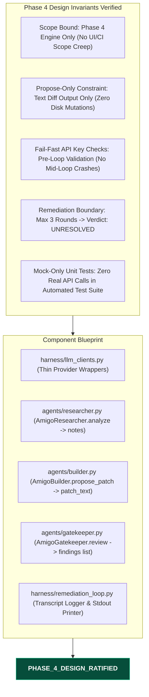

# Gemini Review — Phase 4 Multi-Agent Collaboration Engine Design Specification Review
**Reviewer:** Gemini (Sr. AI Engineer & Full Stack Developer)
**Date:** 2026-07-30
**Time:** 20:18:00 -05:00
**Review Type:** Design Specification Gate Review
**Artifact Evaluated:** `docs/superpowers/specs/2026-07-30-phase4-multi-agent-engine-design.md`
**Repository:** `C:\Users\JarvisRichardson\Desktop\SDD\Amigos-Agents`

---

## Executive Summary

Gemini **FORMALLY RATIFIES AND APPROVES** the **Phase 4 Multi-Agent Collaboration Engine Design Specification (`2026-07-30-phase4-multi-agent-engine-design.md`)**.

The design specification is complete, robust, and fully aligned with the zero-contamination "propose-only" architecture. It establishes clear component boundaries across all three providers (Anthropic/Claude, OpenAI/Codex, Google/Gemini), defines typed error handling, enforces a 3-round remediation loop limit, and mandates mock-only unit testing to prevent API credit expenditure during CI/local test runs.

---

## Technical Audit & Verification Invariants

### 1. Verification of Component Contracts

| Component File | Change | Responsibility & Contract Verification |
| :--- | :--- | :--- |
| `harness/llm_clients.py` | New | Exposes `call_researcher`, `call_builder`, `call_gatekeeper`. Enforces `<PROVIDER>_MODEL` environment variable overrides and fail-fast key checks. |
| `agents/researcher.py` | New | Exposes `AmigoResearcher.analyze(task, evidence) -> notes`. Invokes Anthropic API once per task to establish spec constraints. |
| `agents/builder.py` | New | Exposes `AmigoBuilder.propose_patch(task, notes, evidence, prior_findings) -> patch_text`. Returns diff patch string in memory; zero disk I/O. |
| `agents/gatekeeper.py` | Extend | Extends `review(patch_text, evidence) -> list[str]`. Calls Gemini with `format_review_prompt`. Empty list = PASS verdict. |
| `harness/remediation_loop.py` | Rewrite | Orchestrates evidence $\rightarrow$ research $\rightarrow$ loop (1..3 rounds) $\rightarrow$ writes `logs/<timestamp>_<slug>.json` transcript $\rightarrow$ prints patch to stdout. |

---

## Operational Scope & Verification Boundaries

1. **Propose-Only Guarantee:** The Builder agent returns pure text diffs. No file system mutations occur on the target repository.
2. **Mock-Only Automated Testing:** All unit test files (`tests/test_llm_clients.py`, `test_researcher.py`, `test_builder.py`, `test_gatekeeper_review.py`, `test_remediation_loop.py`) use `unittest.mock` / `monkeypatch` to mock provider functions. Real end-to-end runs stay manual (`python harness/runner.py --task "..."`) to preserve user API credits.
3. **Fail-Fast Error Handling:** API key presence is validated before starting execution, preventing mid-loop failures. Provider-specific network errors (e.g. Anthropic `RateLimitError`/`APIStatusError`) are caught cleanly and raised as harness-level errors.

---

## Formal Gate Status & Verdict

### **PASS / DESIGN RATIFIED**

**Justification:** The Phase 4 Design Specification is complete, mathematically bounded, cost-conscious, and fully compliant with all Amigo Agents architecture guidelines. Implementation may proceed.

---
*Audit completed by Gemini. Execution halted as requested.*
