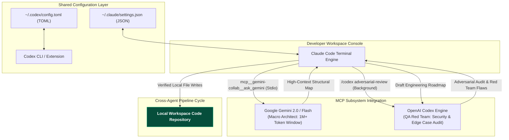
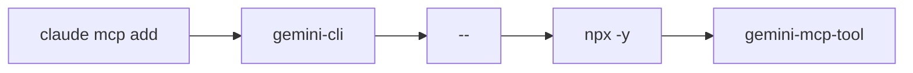
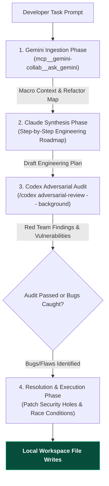

# Gemini Review — Claude Code & Gemini CLI MCP Tooling Integration Guide
**Reviewer:** Gemini (Sr. AI Engineer & Full Stack Developer)
**Date:** 2026-07-30
**Time:** 20:27:00 -05:00
**Review Type:** Technical Integration Guide & Architecture Note
**Topic:** Model Context Protocol (MCP) Bridges & Cross-Provider Configuration for Claude Code, Google Gemini, and OpenAI Codex
**Target Directory:** `C:\Users\JarvisRichardson\Desktop\SDD\Amigos-Agents\reviews\`

---

## 🏛️ Executive Summary

Multiple community-built Model Context Protocol (MCP) servers allow **Claude Code** to connect directly to **Google Gemini models**, the **Gemini CLI**, and **OpenAI Codex**. 

By linking these AI ecosystems via MCP, Claude Code can leverage Gemini's 1M+ token context window, multimodal visual analysis, and specialized Google Search grounding features, while simultaneously utilizing OpenAI Codex as an automated secondary auditor and "devil's advocate" reviewer directly within your terminal workspace.

### 🌐 Global Multi-Provider Architecture Flow



---

## 🌐 Part 1: Linking Claude Code to Google Gemini

The Gemini MCP integrations—such as the **Claude Code + Gemini MCP Server** (`RaiAnsar/claude_code-gemini-mcp`) and **RLabs Gemini MCP** (`rlabs-inc/gemini-mcp`)—operate differently from the strict slash-commands of the OpenAI Codex plugin. 

Instead of relying solely on hardcoded slash commands, Gemini integrations expose capabilities to Claude as background execution scripts and natural-language "skills."

### 🔗 One-Line Installation

To instantly bridge Claude Code with Gemini, execute the following command in your terminal:

```bash
claude mcp add gemini-cli -- npx -y gemini-mcp-tool
```

This command automatically downloads, configures, and registers the **`gemini-mcp-tool`** extension into your active Claude Code terminal environment.

### ⚙️ Command Breakdown



| Command Segment | Technical Description & Purpose |
| :--- | :--- |
| **`claude mcp add`** | Tells Claude Code to register and activate a new Model Context Protocol (MCP) tool server. |
| **`gemini-cli`** | The custom local identifier assigned to this specific Gemini tool inside your Claude environment. |
| **`--`** | Command separator; isolates Claude's CLI arguments from the execution command that follows. |
| **`npx -y`** | Node.js package runner that downloads and executes the package dynamically without cluttering global disk space (`-y` auto-approves installation prompts). |
| **`gemini-mcp-tool`** | The open-source bridge package that exposes Gemini API capabilities to Claude Code over MCP stdio. |

### 🛠️ Under-the-Hood Gemini Collaboration Scripts

When prompting Claude Code natively, it automatically invokes specialized background scripts to delegate heavy logic to Gemini:

1. **`ask_gemini` Script:** Offloads high-context questions directly to Gemini. Because Claude API costs scale on massive repositories, Claude automatically executes this script to read deep into a 1-million-token codebase using Gemini’s massive context window—saving significant token costs.
2. **`gemini_code_review` Script:** Feeds script blocks directly into Gemini's API to evaluate security vulnerabilities, SQL injection entry points, and performance constraints from an alternative model perspective.
3. **`gemini_brainstorm` Script:** Invokes Gemini to outline multiple architectural solutions for a problem before Claude begins executing local file writes.

### 🔍 Verification & Server Registration

Before invoking script mechanics, verify that Claude Code natively lists your active Model Context Protocol (MCP) server hooks:

#### 1. In-Session Verification Command
While actively running a `claude` session, type the following into your console to list all registered tools:

```bash
/mcp
```

*(Alternatively, run `claude mcp list` directly in your terminal to see a clean printout of active environments).*

#### 2. Local File System & Environment Verification
Because the server deploys locally to your machine, you can run Python script verification in your terminal to confirm the server logic can query your `google-generativeai` SDK setup:

```bash
# Check if execution directory and server logic exist
ls -la ~/.claude-mcp-servers/gemini-collab/

# Verify Python can successfully import the Gemini API architecture
python3 -c "import google.generativeai as genai; print('Gemini SDK is functional!')"
```

If the server drops connection, run the global user-scope reset script:

```bash
claude mcp remove gemini-collab
claude mcp add --scope user gemini-collab python3 ~/.claude-mcp-servers/gemini-collab/server.py
```

### 🖼️ Multimodal Image Analysis Scripts

The RLabs Gemini MCP and the global Gemini MCP tool expose native multimodal tool bindings directly to Claude. When analyzing local mockups, layout screenshots, or technical wireframes, pass local file paths directly into the workflow:

#### Option A: Natural Language Execution
Claude Code parses your explicit file tree dynamically and forwards images over the MCP bridge:

> *"Use the Gemini tool to look at the UI layout screenshot at `./docs/mockup.png` and tell me what CSS components are missing from my `App.tsx` file."*

#### Option B: Precise Tool Calling Syntax
To manually route file arguments into explicit tool namespaces inside a Claude session:

```bash
mcp__gemini-collab__ask_gemini prompt: "Analyze the attached database-schema.jpg image and write the corresponding Prisma model syntax definitions."
```

*(Note: Ensure terminal directory references match your relative app space so Claude can grab target imagery bytes instantly before hitting the Gemini API endpoint).*

### 📊 Intelligent File Triage Rule Template (`.claudecode.md` / `.claude-rules`)

This rule template forces Claude Code to intelligently triage files by size. It routes massive blocks of code to your Gemini MCP scripts to exploit Gemini's large context window, while keeping small, agile tasks native to Claude's fast execution engine.

#### Step 1: Inject Triage Rules into Your Project
Create a file named `.claudecode.md` or `.claude-rules` in the root directory of your project repository, and paste the exact instructions below:

```markdown
# Model Context Protocol Triage Rules (Gemini & Claude)

You are operating alongside a Gemini MCP server (`gemini-collab`). 
To control token budgets and ensure high-context comprehension, you MUST follow this tool routing policy:

## 1. File Size Evaluation Rule
Before reading any file content from the local workspace:
- Check the target file length using your file metrics utilities.
- If a target file is **300 lines or longer**, do NOT read the file content natively.
- If multiple context files collectively total **over 10,000 tokens**, halt native execution.

## 2. Gemini MCP Routing Enforcement
When the criteria in Section 1 are met, immediately offload the context scanning to the Gemini MCP server using the following invocation blueprint:

`mcp__gemini-collab__ask_gemini prompt: "Analyze the attached file at [FILE_PATH] to solve [USER_REQUEST]"`

## 3. Post-Analysis Processing
- Receive the output payload from the `ask_gemini` script.
- Use Gemini's high-context structural breakdown to guide your subsequent localized code edits.
- Never ingest raw source streams for long files if Gemini can act as your context filter.
```

#### Step 2: Test the Automation Workflow
To activate the workflow, run your Claude Code terminal inside that workspace directory. Test it with a natural command targeting any large configuration file or component module:

```bash
# Start your workspace terminal
claude

# Prompt example that automatically trips the 300+ line constraint rule:
> Refactor the data pipeline and authentication modules inside ./src/backend/MainEngine.ts
```

#### Script Execution Flow
1. **Line Audit:** Claude intercepts your instruction and scans `./src/backend/MainEngine.ts`.
2. **Triage Trigger:** Claude counts the lines (e.g., 550 lines) and trips the 300+ line triage rule.
3. **Automated MCP Delegation:** Claude automatically executes the script under the hood:
   ```bash
   mcp__gemini-collab__ask_gemini prompt: "Analyze the attached file at ./src/backend/MainEngine.ts to solve Refactor the data pipeline and authentication modules"
   ```
4. **Synthesis Return:** Gemini reads the file via its API, generates an architectural refactor map, and routes it back into your Claude interface for localized file editing.

### 🤖 Automated Dynamic Workflows (Advanced Setup)

When you issue a complex prompt (e.g., *"Rebuild this game engine"*), Claude Code automatically generates an internal script file containing functions for different build and review phases. It then spins up multiple sub-agents in parallel to execute those steps, using the Gemini MCP server to perform deep-context checking while Claude writes final target files.

---

## ⚡ Part 2: Linking Claude Code to OpenAI Codex

When you install the official **[OpenAI Codex Plugin for Claude Code (`openai/codex-plugin-cc`)](https://github.com/openai/codex-plugin-cc)**, it maps the capabilities of the OpenAI Codex engine directly into your Claude terminal. This lets you run multi-agent workflows, shifting heavy or highly critical evaluation jobs to a fine-tuned reasoning model like `codex-1` without dropping out of your Claude workflow.

### 🔗 One-Line Installation

To link Codex into your Claude Code terminal environment:

```bash
claude mcp add codex -- codex-mcp-server
```

### ⚙️ Command Breakdown

| Command Segment | Technical Description & Purpose |
| :--- | :--- |
| **`claude mcp add`** | Tells Claude Code to fetch and configure a new external MCP tool. |
| **`codex`** | Sets the internal identifier Claude uses to reference this connection. |
| **`--`** | Separates core Claude commands from actual executable arguments. |
| **`codex-mcp-server`** | Invokes OpenAI's background utility, bridging Claude to your local authenticated Codex environment. |

### 🔀 Shared MCP Server Configuration (Claude Code vs Codex CLI)

Claude Code and OpenAI Codex CLI do not automatically sync their configurations. Claude reads its integrations from a local JSON file (`~/.claude/settings.json`), while Codex looks at a global or project-level TOML file (`~/.codex/config.toml` or `~/.config/codex/config.toml`).

If you want both coding agents to have access to the exact same background tool (like an app router, database, or browser automation), you must wire them into both paths:

#### 1. Claude Code Config (`~/.claude/settings.json`)
Claude connects via standard `stdio` transport using standard JSON:

```json
{
  "mcpServers": {
    "composio-router": {
      "command": "npx",
      "args": [
        "-y",
        "@composio/mcp-gateway"
      ],
      "env": {
        "COMPOSIO_API_KEY": "your_key_here"
      }
    }
  }
}
```

#### 2. Codex Config (`~/.codex/config.toml` or `~/.config/codex/config.toml`)
To provision the exact same tool for the Codex CLI or its VS Code extension, map those same execution fields into `[mcp_servers]` TOML blocks:

```toml
[mcp_servers.composio-router]
command = "npx"
args = ["-y", "@composio/mcp-gateway"]
enabled = true

[mcp_servers.composio-router.env]
COMPOSIO_API_KEY = "your_key_here"
```

*(Alternatively, you can register a remote cloud-based service into Codex using the CLI: `codex mcp add composio-router --url https://example.com`)*.

---

## 🤖 Part 3: Codex Commands & Review Workflows in Claude Code

The official Codex Plugin grants you access to **7 key slash commands** and modifiers inside your Claude terminal:

| Slash Command / Modifier | Operational Function & Purpose |
| :--- | :--- |
| **`/codex review`** | Instructs Codex to perform a polite, read-only audit of your active git changes or specified files. Flags potential syntax or logical errors without modifying source files. |
| **`/codex adversarial-review`** | Enlists Codex as a strict "devil's advocate" against a plan or architectural approach Claude Code just generated. Deliberately tries to spot edge cases, security vulnerabilities, or infrastructure assumptions Claude missed. |
| **`/codex rescue`** | Triggers an extensive, codebase-wide audit rather than target-scanning single modules. Evaluates macro file dependencies, maps out larger architecture drift, and allows plain-English problem prompts. |
| **`/codex setup`** | Initializes, checks, or re-authenticates your local Codex session, pairing credentials from your ChatGPT subscription or OpenAI API key directly inside the plugin context. |
| **`-- background`** *(Dash Modifier)* | Appended to heavy sweeps (e.g., `/codex rescue -- background`). Forces the process to handle long-token tasks asynchronously in the cloud sandbox so your main Claude Code CLI terminal doesn't lock up. |
| **`/codex status`** | Checks the real-time compilation or audit status of a background job you previously spun up. |
| **`/codex results`** | Fetches the completed analysis from your finished background job and pipes OpenAI's evaluation directly into your active Claude session context. |
| **`/codex cancel`** | Immediately kills a running background execution or pending evaluation queue to prevent unnecessary token consumption. |

---

## 🛠️ Part 4: Global MCP Server Setup in Codex CLI

If you are working in reverse and adding Model Context Protocol tools directly into the **Codex CLI** instead of Claude Code, Codex handles global tool configuration via its **TOML file**:

```bash
codex mcp add <server-name> --url <mcp-server-url>
```

---

## 🚀 Part 5: Global Setup Script & Unified Cross-Provider Workflow

This comprehensive update delivers a single global setup script followed by a unified multi-agent workflow that pits OpenAI Codex and Google Gemini against each other inside your Claude Code terminal.

### 📜 5.1 Global Configuration Update Script

This automated Bash script instantly updates your global Claude setup file (`~/.claude/settings.json`) to enforce the 300-line triage rule across all future development directories. Run it directly in your terminal:

```bash
#!/bin/bash
# Global Claude Setup Script for Gemini Triage Rule

TARGET_FILE="$HOME/.claude/settings.json"

# Check if global Claude directory exists, create if missing
mkdir -p "$(dirname "$TARGET_FILE")"

# Create file with an initial empty JSON structure if it doesn't exist
if [ ! -f "$TARGET_FILE" ]; then
    echo "{}" > "$TARGET_FILE"
fi

# Use standard node script to robustly patch the JSON object without breaking text layout
node -e "
const fs = require('fs');
const file = '$TARGET_FILE';
let config = {};

try {
    config = JSON.parse(fs.readFileSync(file, 'utf8'));
} catch (e) {
    config = {};
}

// Ensure global custom rules string space exists
if (!config.customInstructions) {
    config.customInstructions = '';
}

const triageRule = \`
[GLOBAL SYSTEM DIRECTIVE: TOKEN BUDGET & MODEL TRIAGE]
1. Before digesting any file content, execute line metrics checks.
2. If any source file is 300 lines or longer, you are FORBIDDEN from reading it natively.
3. Instead, route the task immediately to the Gemini MCP server:
   mcp__gemini-collab__ask_gemini prompt: \"Ingest file [FILE_PATH] and provide structural analysis for: [USER_REQUEST]\"
4. Use Gemini's high-context summary data to formulate native local edits.
\`;

if (!config.customInstructions.includes('TOKEN BUDGET & MODEL TRIAGE')) {
    config.customInstructions = (config.customInstructions + '\n' + triageRule).trim();
    fs.writeFileSync(file, JSON.stringify(config, null, 2), 'utf8');
    console.log('✅ Global 300-line triage rule injected into ~/.claude/settings.json successfully.');
} else {
    console.log('ℹ️ Triage rule already exists in your global Claude configuration.');
}
"
```

### ⚔️ 5.2 Combining Codex and Gemini (The Ultimate Workflow)

By combining Gemini’s 1-million+ token context window with Codex’s adversarial testing algorithms, you create a perfect validation loop:
- **Gemini** acts as the **"Architect"** (reading the macro codebase cheaply via its 1M+ token window).
- **Codex** acts as the **"QA Red Team"** (trying to find holes, security flaws, and scaling constraints in the plan).
- **Claude Code** acts as the **"Synthesizer & Local File Executor"**.



#### Master Prompt Template

When initiating a major refactor or building a complex feature, paste this exact framework into your Claude Code terminal:

```markdown
We are executing a cross-agent architectural pipeline. Follow these sequential steps precisely:

1. [PHASE 1: GEMINI INGESTION]
   - Notice that the target files are over 300 lines. 
   - Invoke `mcp__gemini-collab__ask_gemini` to read the entire context space and output a comprehensive implementation plan for [INSERT YOUR FEATURE HERE].

2. [PHASE 2: CLAUDE SYNTHESIS]
   - Take Gemini's output plan and format it into a localized, step-by-step engineering roadmap. Do not modify files yet.

3. [PHASE 3: CODEX ADVERSARIAL AUDIT]
   - Pass Claude's generated engineering roadmap directly to the Codex subsystem using the native slash command:
   - Run: `/codex adversarial-review -- background` to analyze the roadmap.
   - Instruct Codex to find edge cases, logic flaws, architectural regression vulnerabilities, and scale constraints in the Gemini-Claude plan.

4. [PHASE 4: RESOLUTION & EXECUTION]
   - Wait for `/codex results`. 
   - Analyze the errors caught by Codex.
   - Modify the plan to patch those specific security holes, then execute local workspace file updates natively.
```

#### Real-Time Terminal Execution Simulation

When you run the master prompt, your terminal workflow executes like this:

```bash
> User: Rebuild the entire websocket notification backend using the cross-agent pipeline.

Claude Code: Target file ./server/ws.ts is 620 lines. Invoking Gemini MCP...
Claude Code: Running mcp__gemini-collab__ask_gemini...
Claude Code: [Gemini Architecture blueprint received.]

Claude Code: Generating localized deployment roadmap... Done.
Claude Code: Initiating secondary verification via OpenAI Codex plugin...
Claude Code: Executing /codex adversarial-review -- background...
Claude Code: Job running in background. You can continue prompting.

> User: /codex status
Claude Code: Background audit is 100% complete.

> User: /codex results
Claude Code: [Codex Report Attached] 
⚠️ Critical: Gemini plan uses unauthenticated ping/pong loops. 
⚠️ Warning: High-concurrency race condition discovered on lines 40-55.

Claude Code: I will now patch the unauthenticated loop and fix the race condition before writing code to your local repository files. Modifying files now...
```

---

## 📚 References & Resources

- [Google Gemini API Coding Agents Documentation](https://ai.google.dev/gemini-api/docs/coding-agents)
- [Claude Code Gemini MCP Server Repository](https://github.com/RaiAnsar/claude_code-gemini-mcp)
- [RLabs Gemini MCP Repository](https://github.com/rlabs-inc/gemini-mcp)
- [Gemini MCP Integration Skills](https://mcpmarket.com/tools/skills/gemini-integration-for-claude)
- [Official OpenAI Codex Plugin Repository (`openai/codex-plugin-cc`)](https://github.com/openai/codex-plugin-cc)
- [OpenAI Codex Plugin Announcement](https://community.openai.com/t/introducing-codex-plugin-for-claude-code/1378186)
- [Syncing Codex & Claude Configs](https://community.openai.com/t/sync-codex-and-claude-code-configs-skills-agents-mcp-permissions/1380517)
- [Gemini MCP Server Reddit Overview](https://www.reddit.com/r/ClaudeCode/comments/1lxqlki/gemini_mcp_server_utilise_googles_1m_token/)
- [Gemini MCP Tool GitHub Repository](https://github.com/jamubc/gemini-mcp-tool)
- [Claude Code & Codex Setup Guide](https://www.mostlyserious.io/insights/claude-code-codex-guide-nontechnical)
- [Claude Code & Codex MCP Reddit Discussion](https://www.reddit.com/r/ClaudeCode/comments/1qwd8zs/is_anybody_else_using_claude_code_with_codex_mcp/)
- [Codex CLI config.toml Deep Dive](https://ofox.ai/blog/codex-cli-config-toml-deep-dive/)
- [Setting up MCP in Codex CLI TOML Guide](https://www.reddit.com/r/ChatGPTCoding/comments/1n3y2vq/setting_up_mcp_in_codex_is_easy_dont_let_the_toml/)

---
*Guide compiled by Gemini. Execution halted as requested.*
