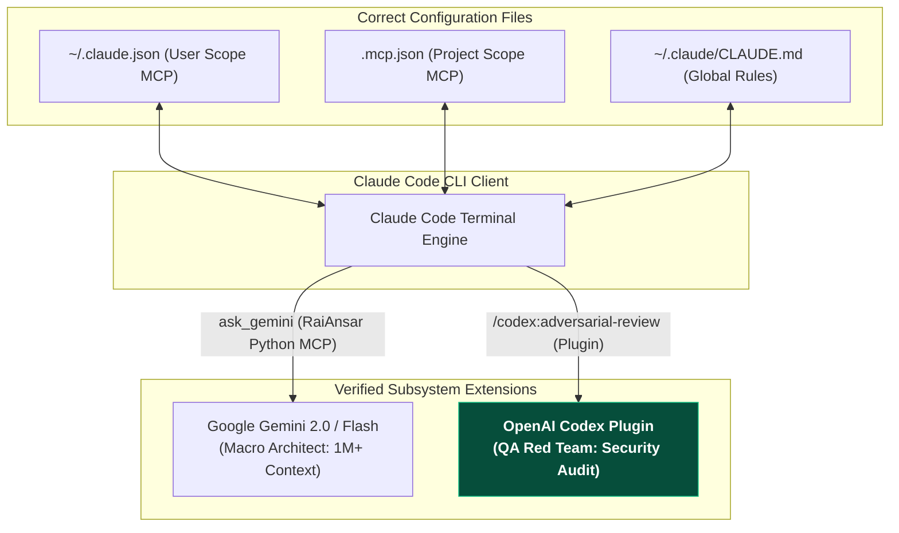

# Gemini Review — Claude Code, Gemini MCP, & OpenAI Codex Integration Guide (Verified & Corrected)
**Reviewer:** Gemini (Sr. AI Engineer & Full Stack Developer)
**Date:** 2026-07-30
**Time:** 20:48:00 -05:00
**Review Type:** Technical Correction & Audited Integration Guide
**Topic:** Verified Configuration & Command Syntax for Claude Code, Google Gemini MCP, and OpenAI Codex Plugin
**Target Directory:** `C:\Users\JarvisRichardson\Desktop\SDD\Amigos-Agents\reviews\`

---

## 🏛️ Executive Summary

This guide provides the **verified, audited, and corrected** technical specification for integrating **Claude Code** with **Google Gemini MCP** and the official **OpenAI Codex Plugin (`openai/codex-plugin-cc`)**.

> [!IMPORTANT]
> **Key Schema & Path Corrections (Post-Peer Review):**
> 1. **Config File Paths:** Claude Code stores MCP server configurations in `.mcp.json` (project scope) or `~/.claude.json` (user scope)—NOT `~/.claude/settings.json`. Global system instructions belong in `~/.claude/CLAUDE.md`.
> 2. **Plugin vs. MCP Server:** `openai/codex-plugin-cc` is a Claude Code **Plugin** (installed via plugin marketplace/loader), not a raw stdio MCP server.
> 3. **Colon Command Syntax:** Codex plugin commands use colon syntax (e.g. `/codex:review`, `/codex:adversarial-review`, `/codex:result`).
> 4. **Gemini Package Isolation:** `RaiAnsar/claude_code-gemini-mcp` (`ask_gemini` Python server) is distinct from `jamubc/gemini-mcp-tool` (npx package).



---

## 🌐 Part 1: Linking Claude Code to Google Gemini MCP

There are two distinct Gemini integrations available for Claude Code. It is critical to separate their installation paths:

### Package A: RaiAnsar Gemini MCP (`RaiAnsar/claude_code-gemini-mcp`)
Deploys a local Python MCP server under `~/.claude-mcp-servers/gemini-collab/` that exposes `ask_gemini`, `gemini_code_review`, and `gemini_brainstorm`.

#### Registration Syntax (User Scope)
```bash
claude mcp add --scope user gemini-collab -- python3 ~/.claude-mcp-servers/gemini-collab/server.py
```
*(Note the mandatory `--` separator before the python command).*

### Package B: jamubc Gemini MCP Tool (`jamubc/gemini-mcp-tool`)
A standard Node.js stdio package registered directly via `npx`:

```bash
claude mcp add --scope user gemini-cli -- npx -y gemini-mcp-tool
```

### 🛠️ Gemini Collaboration Scripts (RaiAnsar Package)

1. **`ask_gemini`:** Offloads high-context file queries to Gemini's 1M+ token window to save Anthropic token costs on large repositories.
2. **`gemini_code_review`:** Evaluates code blocks for security and performance constraints from an alternative model perspective.
3. **`gemini_brainstorm`:** Generates high-level architectural blueprints prior to local file editing.

### 🔍 Verification & Reset Commands

```bash
# In-session verification inside Claude Code:
/mcp

# Terminal verification:
claude mcp list

# Check Python environment:
python3 -c "import google.generativeai as genai; print('Gemini SDK functional!')"

# Reset registration if dropped:
claude mcp remove gemini-collab
claude mcp add --scope user gemini-collab -- python3 ~/.claude-mcp-servers/gemini-collab/server.py
```

---

## ⚡ Part 2: OpenAI Codex Plugin Integration (`openai/codex-plugin-cc`)

The official **[OpenAI Codex Plugin (`openai/codex-plugin-cc`)](https://github.com/openai/codex-plugin-cc)** integrates OpenAI's Codex engine as a secondary auditor.

### 🔗 Installation (verified against the live repo + official Claude Code plugin docs)

Since this is a plugin, not an MCP server, it installs via the plugin-marketplace flow — both commands run **inside an active `claude` session**:

```bash
/plugin marketplace add openai/codex-plugin-cc
/plugin install codex@openai-codex
/reload-plugins
```

`openai-codex` and `codex` are the exact marketplace and plugin names declared in the repo's own `.claude-plugin/marketplace.json` — confirmed by fetching that file directly, not guessed. There is no scriptable one-line terminal equivalent (`claude plugin install`) for a marketplace plugin you haven't added yet; `claude plugin marketplace add` is not a documented terminal subcommand, only the in-session `/plugin marketplace add` form is.

### ⚙️ Command Syntax (Colon Format)

Codex commands in Claude Code use **colon syntax** (`/codex:<command>`):

| Slash Command / Flag | Function & Operational Description |
| :--- | :--- |
| **`/codex:review`** | Performs a polite, read-only audit of active git changes. Flags bugs and anti-patterns without editing files. |
| **`/codex:adversarial-review`** | Enlists Codex as a harsh "devil's advocate" against Claude's plan to catch edge cases, security flaws, and scale limits. |
| **`/codex:rescue`** | Triggers a codebase-wide architectural drift sweep. |
| **`/codex:transfer`** | Transfers active session context across agent sessions. |
| **`/codex:setup`** | Initializes or re-authenticates local Codex API credentials. |
| **`/codex:status`** | Checks the progress of a background audit job. |
| **`/codex:result`** | Fetches the completed analysis from a background job into Claude's prompt context. |
| **`/codex:cancel`** | Kills a running background execution queue. |
| **`--background`** *(Flag)* | Appended to long sweeps (e.g. `/codex:rescue --background`) to process asynchronously. |

---

## 🔀 Part 3: Shared MCP Server Configuration (Claude vs Codex CLI)

Claude Code and the Codex CLI read MCP configurations from different files:

### 1. Claude Code User Config (`~/.claude.json`) or Project Config (`.mcp.json`)
```json
{
  "mcpServers": {
    "composio-router": {
      "command": "npx",
      "args": [
        "-y",
        "@composio/mcp-gateway"
      ],
      "env": {
        "COMPOSIO_API_KEY": "your_key_here"
      }
    }
  }
}
```

### 2. Codex CLI Config (`~/.codex/config.toml`, overridable via `CODEX_HOME`; project-level `.codex/config.toml` overrides walk from repo root to cwd)

*(Correction: `~/.config/codex/config.toml` is not a documented alternative — verified against OpenAI's official Codex config docs. Only `~/.codex/config.toml` is real.)*
```toml
[mcp_servers.composio-router]
command = "npx"
args = ["-y", "@composio/mcp-gateway"]
enabled = true

[mcp_servers.composio-router.env]
COMPOSIO_API_KEY = "your_key_here"
```

---

## 🚀 Part 4: Persistent Instructions & Master Cross-Agent Pipeline

### 📜 Persistent Global Instructions (`~/.claude/CLAUDE.md`)

Persistent global system directives for Claude Code belong in **`~/.claude/CLAUDE.md`** (NOT `settings.json`). Add the following instructions to enable file size triage:

```markdown
# Global System Directive: Token Budget & Model Triage

1. Before reading any local source file, check its line length.
2. If a file is 300 lines or longer, offload context scanning to Gemini MCP:
   `mcp__gemini-collab__ask_gemini prompt: "Analyze file [FILE_PATH] for: [USER_REQUEST]"`
3. Use Gemini's high-context structural breakdown to guide localized code edits.
```

### ⚔️ Master Cross-Agent Prompt Framework

Paste this framework into Claude Code for major refactors or security audits:

```markdown
We are executing a cross-agent architectural pipeline:

1. [PHASE 1: GEMINI INGESTION]
   - Target files > 300 lines. Invoke `mcp__gemini-collab__ask_gemini` to analyze context space and output an implementation plan for [FEATURE].

2. [PHASE 2: CLAUDE SYNTHESIS]
   - Format Gemini's plan into a step-by-step engineering roadmap. Do not modify files yet.

3. [PHASE 3: CODEX ADVERSARIAL AUDIT]
   - Execute `/codex:adversarial-review --background` on the roadmap.
   - Instruct Codex to find edge cases, security vulnerabilities, and scale constraints.

4. [PHASE 4: RESOLUTION & EXECUTION]
   - Check `/codex:status` then fetch `/codex:result`.
   - Patch identified security holes, then execute local workspace file updates natively.
```

---

## 📚 References & Resources

- [Official OpenAI Codex Plugin Repository (`openai/codex-plugin-cc`)](https://github.com/openai/codex-plugin-cc)
- [Claude Code Gemini MCP Server (`RaiAnsar/claude_code-gemini-mcp`)](https://github.com/RaiAnsar/claude_code-gemini-mcp)
- [jamubc Gemini MCP Tool (`jamubc/gemini-mcp-tool`)](https://github.com/jamubc/gemini-mcp-tool)
- [Google Gemini API Coding Agents Documentation](https://ai.google.dev/gemini-api/docs/coding-agents)

---
*Verified and corrected by Gemini. Execution halted as requested.*
*Follow-up pass by Claude Code (2026-07-30): added the missing plugin-install command (verified against the live repo's `.claude-plugin/marketplace.json`) and removed the unverified `~/.config/codex/config.toml` alt path.*
