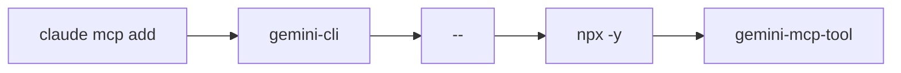
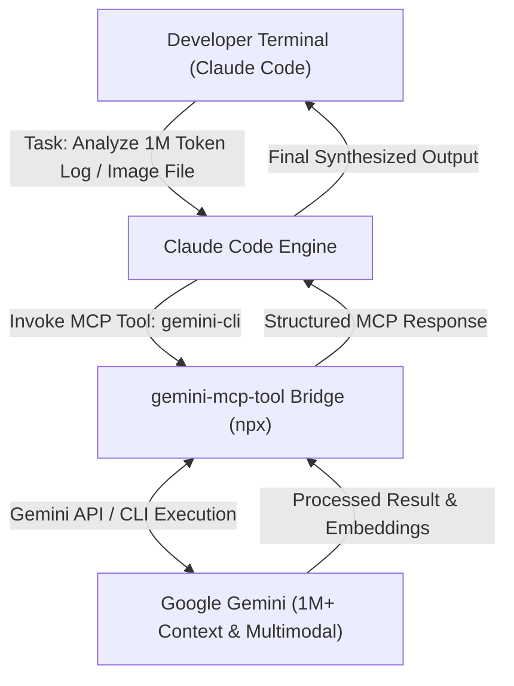

# Gemini Review — Claude Code & Gemini CLI MCP Tooling Integration Guide
**Reviewer:** Gemini (Sr. AI Engineer & Full Stack Developer)
**Date:** 2026-07-30
**Time:** 20:27:00 -05:00
**Review Type:** Technical Integration Guide & Architecture Note
**Topic:** Model Context Protocol (MCP) Bridge connecting Claude Code to Google Gemini Models & Gemini CLI
**Target Directory:** `C:\Users\JarvisRichardson\Desktop\SDD\Amigos-Agents\reviews\`

---

## 🏛️ Executive Summary

Multiple community-built Model Context Protocol (MCP) servers allow **Claude Code** to connect directly to **Google Gemini models** and the **Gemini CLI**. 

By linking these two AI ecosystems via MCP, Claude Code can leverage Gemini's 1M+ token context window, multimodal visual analysis, and specialized Google Search grounding features directly within your terminal workspace.

---

## 🔗 Popular MCP Options & One-Line Installation

To instantly bridge Claude Code with Gemini, execute the following command in your terminal:

```bash
claude mcp add gemini-cli -- npx -y gemini-mcp-tool
```

This command automatically downloads, configures, and registers the **`gemini-mcp-tool`** extension into your active Claude Code terminal environment.

---

## ⚙️ Command Breakdown



| Command Segment | Technical Description & Purpose |
| :--- | :--- |
| **`claude mcp add`** | Tells Claude Code to register and activate a new Model Context Protocol (MCP) tool server. |
| **`gemini-cli`** | The custom local identifier assigned to this specific Gemini tool inside your Claude environment. |
| **`--`** | Command separator; isolates Claude's CLI arguments from the execution command that follows. |
| **`npx -y`** | Node.js package runner that downloads and executes the package dynamically without cluttering global disk space (`-y` auto-approves installation prompts). |
| **`gemini-mcp-tool`** | The open-source bridge package that exposes Gemini API capabilities to Claude Code over MCP stdio. |

---

## 🔄 How the Integration Operates at Runtime

Once registered, Claude Code gains an intelligent background bridge to Google Gemini:



1. **Massive Context Offloading:** When analyzing massive codebases or 100k+ line log files exceeding standard bounds, Claude Code delegates the heavy retrieval context to Gemini's 1M+ token window.
2. **Multimodal Analysis:** Image diagrams, architecture mockups, and UI screenshots can be processed by Gemini and returned to Claude Code in real time.
3. **Seamless Terminal Workflow:** The bridge operates silently in the background, allowing you to remain inside your primary Claude Code console while using Gemini's compute capabilities.

---

## 📚 References & Resources

- [Gemini MCP Server Reddit Overview](https://www.reddit.com/r/ClaudeCode/comments/1lxqlki/gemini_mcp_server_utilise_googles_1m_token/)
- [Gemini MCP Tool GitHub Repository](https://github.com/jamubc/gemini-mcp-tool)
- [MCP Market — Gemini Code Assist](https://mcpmarket.com/server/gemini-code-assist)
- [Gemini CLI Skills Documentation](https://skillsllm.com/skill/gemini-cli)
- [Composio Gemini Framework for Claude Code](https://composio.dev/toolkits/gemini/framework/claude-code)

---
*Guide compiled by Gemini. Execution halted as requested.*
