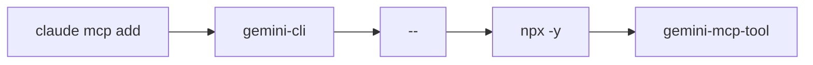
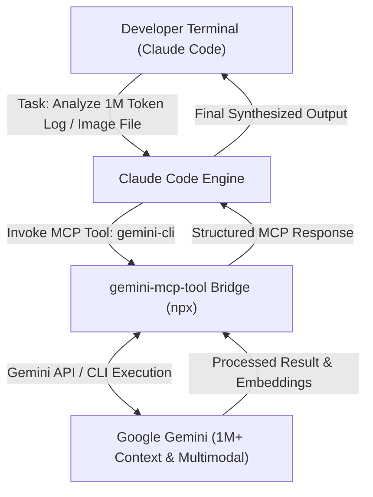

# Gemini Review — Claude Code & Gemini CLI MCP Tooling Integration Guide
**Reviewer:** Gemini (Sr. AI Engineer & Full Stack Developer)
**Date:** 2026-07-30
**Time:** 20:27:00 -05:00
**Review Type:** Technical Integration Guide & Architecture Note
**Topic:** Model Context Protocol (MCP) Bridges connecting Claude Code to Google Gemini Models & OpenAI Codex
**Target Directory:** `C:\Users\JarvisRichardson\Desktop\SDD\Amigos-Agents\reviews\`

---

## 🏛️ Executive Summary

Multiple community-built Model Context Protocol (MCP) servers allow **Claude Code** to connect directly to **Google Gemini models**, the **Gemini CLI**, and **OpenAI Codex**. 

By linking these AI ecosystems via MCP, Claude Code can leverage Gemini's 1M+ token context window, multimodal visual analysis, and specialized Google Search grounding features, while simultaneously utilizing OpenAI Codex as an automated secondary auditor and "devil's advocate" reviewer directly within your terminal workspace.

---

## 🌐 Part 1: Linking Claude Code to Google Gemini

### 🔗 One-Line Installation

To instantly bridge Claude Code with Gemini, execute the following command in your terminal:

```bash
claude mcp add gemini-cli -- npx -y gemini-mcp-tool
```

This command automatically downloads, configures, and registers the **`gemini-mcp-tool`** extension into your active Claude Code terminal environment.

### ⚙️ Command Breakdown



| Command Segment | Technical Description & Purpose |
| :--- | :--- |
| **`claude mcp add`** | Tells Claude Code to register and activate a new Model Context Protocol (MCP) tool server. |
| **`gemini-cli`** | The custom local identifier assigned to this specific Gemini tool inside your Claude environment. |
| **`--`** | Command separator; isolates Claude's CLI arguments from the execution command that follows. |
| **`npx -y`** | Node.js package runner that downloads and executes the package dynamically without cluttering global disk space (`-y` auto-approves installation prompts). |
| **`gemini-mcp-tool`** | The open-source bridge package that exposes Gemini API capabilities to Claude Code over MCP stdio. |

### 🔄 Gemini Runtime Workflow

Once registered, Claude Code gains an intelligent background bridge to Google Gemini:



1. **Massive Context Offloading:** When analyzing massive codebases or 100k+ line log files exceeding standard bounds, Claude Code delegates heavy retrieval context to Gemini's 1M+ token window.
2. **Multimodal Analysis:** Image diagrams, architecture mockups, and UI screenshots can be processed by Gemini and returned to Claude Code in real time.
3. **Seamless Terminal Workflow:** The bridge operates silently in the background, allowing you to remain inside your primary Claude Code console while using Gemini's compute capabilities.

---

## ⚡ Part 2: Linking Claude Code to OpenAI Codex

The **[OpenAI Codex Plugin](https://community.openai.com/t/introducing-codex-plugin-for-claude-code/1378186)** command bridges the opposite gap, allowing Claude Code to directly call upon OpenAI's Codex engine as a local secondary reviewer or task agent.

### 🔗 One-Line Installation

To link Codex into your Claude Code terminal environment:

```bash
claude mcp add codex -- codex-mcp-server
```

### ⚙️ Command Breakdown

| Command Segment | Technical Description & Purpose |
| :--- | :--- |
| **`claude mcp add`** | Tells Claude Code to fetch and configure a new external MCP tool. |
| **`codex`** | Sets the internal identifier Claude uses to reference this connection. |
| **`--`** | Separates core Claude commands from actual executable arguments. |
| **`codex-mcp-server`** | Invokes OpenAI's background utility, bridging Claude to your local authenticated Codex environment. |

### 🤖 Codex Runtime Workflow & Slash Commands

Once installed, Claude gains specialized slash commands (such as `/codex review` or `/codex adversarial review`):

- **Adversarial Code Audit:** When you ask Claude Code to write complex logic, it can silently route the draft to Codex, letting OpenAI's engine serve as a "devil's advocate" or secondary auditor to catch edge cases before committing code.

---

## 🛠️ Part 3: Global MCP Server Setup in Codex CLI (TOML Configuration)

If you are working in reverse and trying to add Model Context Protocol tools directly into the **Codex CLI** instead of Claude Code, Codex handles configuration via a **TOML file** rather than a JSON file.

You can add tools globally into Codex using the command:

```bash
codex mcp add <server-name> --url <mcp-server-url>
```

---

## 📚 References & Resources

- [Gemini MCP Server Reddit Overview](https://www.reddit.com/r/ClaudeCode/comments/1lxqlki/gemini_mcp_server_utilise_googles_1m_token/)
- [Gemini MCP Tool GitHub Repository](https://github.com/jamubc/gemini-mcp-tool)
- [MCP Market — Gemini Code Assist](https://mcpmarket.com/server/gemini-code-assist)
- [Gemini CLI Skills Documentation](https://skillsllm.com/skill/gemini-cli)
- [Composio Gemini Framework for Claude Code](https://composio.dev/toolkits/gemini/framework/claude-code)
- [OpenAI Codex Plugin Announcement](https://community.openai.com/t/introducing-codex-plugin-for-claude-code/1378186)
- [Claude Code & Codex Setup Guide](https://www.mostlyserious.io/insights/claude-code-codex-guide-nontechnical)
- [Setting up MCP in Codex CLI TOML Guide](https://www.reddit.com/r/ChatGPTCoding/comments/1n3y2vq/setting_up_mcp_in_codex_is_easy_dont_let_the_toml/)

---
*Guide compiled by Gemini. Execution halted as requested.*
