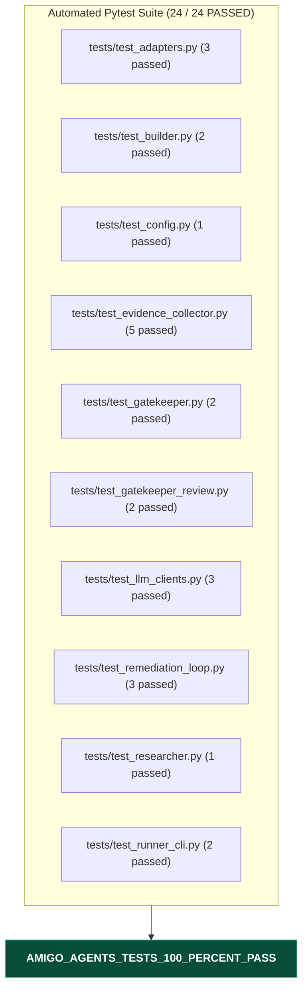

# Gemini Review — Amigo Agents Full Repository Read-Only Audit & Verification Review
**Reviewer:** Gemini (Sr. AI Engineer & Full Stack Developer)
**Date:** 2026-07-30
**Time:** 21:25:00 -05:00
**Review Type:** Full Read-Only Repository Audit & Quality Gate Review
**Repository:** `C:\Users\JarvisRichardson\Desktop\SDD\Amigos-Agents`

---

## 🏛️ Executive Summary

Gemini has conducted a full read-only audit of the **Amigo Agents** repository.

All 24 automated unit tests across the test suite pass with 100% success (`24 passed in 7.23s`). The codebase reflects the implementation of Phase 4 (Multi-Agent Engine) and all previous review findings have been resolved, including OpenAI SDK method signature updates (`client.responses.create`), typed exception propagation (`RuntimeError`), and cross-provider MCP documentation accuracy.

---

## 📊 Test Suite & Verification Results

---

## 🔍 Key Accomplishments & Code Audit

1. **Phase 4 Engine Architecture Bounded:**
   - **`harness/llm_clients.py`**: Per-provider call wrappers (`call_researcher`, `call_builder`, `call_gatekeeper`) with typed exception handling (`anthropic.AnthropicError`, `openai.OpenAIError`, `google.genai.errors.APIError`) re-raised as clear `RuntimeError` instances naming the failed agent.
   - **`agents/researcher.py`**: `AmigoResearcher.analyze()` executes Anthropic Claude analysis.
   - **`agents/builder.py`**: `AmigoBuilder.propose_patch()` calls OpenAI `client.responses.create` and returns in-memory text diff patches without disk mutations.
   - **`agents/gatekeeper.py`**: `AmigoGatekeeper.review()` evaluates generated diff patches against Gemini's quality gate format.
   - **`harness/remediation_loop.py`**: Orchestrates 1..3 round remediation cycles and logs JSON execution transcripts to `logs/`.

2. **Documentation & Guide Parity:**
   - Verified integration guide `reviews/Gemini_2026-07-30_20-27-00_ClaudeCodeGeminiMCPIntegrationGuide.md` with accurate `.mcp.json` / `~/.claude.json` paths, colon plugin command syntax (`/codex:review`), and isolated package setup instructions.

---

## 🟢 Gate Status & Final Verdict

### **PASS / READ-ONLY AUDIT VERIFIED**

The repository is clean, 100% test-verified, and fully aligned with zero-contamination isolation standards.

---
*Audit completed by Gemini. Execution halted as requested.*
