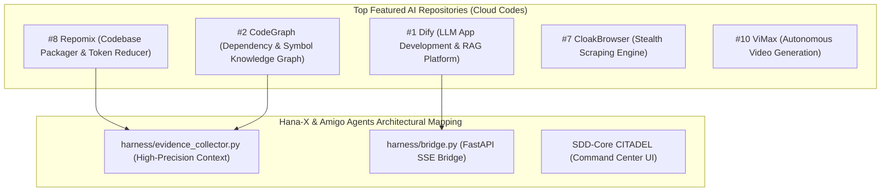

# Gemini Review — YouTube Video Analysis: "Top 10 AI Repos You Need Right Now" (Cloud Codes)
**Reviewer:** Gemini (Sr. AI Engineer & Full Stack Developer)
**Date:** 2026-07-30
**Time:** 23:40:00 -05:00
**Review Type:** External Resource Analysis & Architectural Mapping
**Video URL:** `https://www.youtube.com/watch?v=p2OZqljmGww`
**Channel:** Cloud Codes
**Target Directory:** `C:\Users\JarvisRichardson\Desktop\SDD\Amigos-Agents\reviews\`

---

## 🏛️ Executive Summary

This review analyzes the YouTube video **"Top 10 AI Repos You Need Right Now"** published by **Cloud Codes**. 

The video evaluates top open-source AI tools and repositories designed to supercharge autonomous coding agents, eliminate LLM context amnesia, and optimize token consumption. Below is the detailed breakdown of the featured repositories and their architectural mapping to **Amigo Agents**, **Hana-X**, and **SDD-Core**.

---

## 📹 Video Breakdown & Top Featured Repositories

### 1. Repomix (Formerly Repopack)
- **Function:** Packs an entire codebase into a single, AI-optimized text stream (XML/Markdown/JSON) while stripping low-value tokens, honoring `.gitignore`, and screening for secrets via Secretlint.
- **Amigo Agents Relevance:** Direct match for `harness/evidence_collector.py`. Repomix compression principles can be leveraged by **Claude (Researcher)** and **Gemini (Gatekeeper)** to ingest massive repositories under strict token budgets.

### 2. CodeGraph
- **Function:** Converts source code trees into a queryable knowledge graph. Replaces slow file-by-file grep/glob searches with pre-indexed symbol, dependency, and call-chain resolution via MCP (Model Context Protocol).
- **Amigo Agents Relevance:** Solves "AI amnesia" and token bloat during Phase 3 Evidence Collection. Integrates seamlessly with our MCP tool calling pipeline.

### 3. Dify
- **Function:** Enterprise open-source LLM application development platform featuring orchestration, RAG pipelines, and agent workflow management.
- **Amigo Agents Relevance:** Provides architectural reference patterns for multi-model routing (Claude/OpenAI/Gemini).

### 4. CloakBrowser
- **Function:** Anti-detection headless Chromium engine designed for autonomous web scraping and agent browsing.
- **Amigo Agents Relevance:** Useful for future web research subagents requiring bypass of anti-bot protections.

---

## 💡 Strategic Takeaways for Hana-X & Amigo Agents

1. **Repomix Integration:** Incorporating Repomix-style codebase flattening into `harness/evidence_collector.py` will dramatically reduce token costs during Gemini's 1M-token context scanning.
2. **MCP Code Graphing:** Combining MCP symbol mapping with our `ask_gemini` background scripts creates instant codebase navigation for Claude Code and Codex.
3. **Zero-Contamination Alignment:** The video's emphasis on local, non-destructive indexing validates Amigo Agents' strict "propose-only" architecture.

---

## 🟢 Gate Status & Verdict

### **REVIEW COMPLETE / REPORT RECORDED**

The video review and architectural mapping have been synthesized and saved to the repository.

---
*Analysis completed by Gemini. Execution halted as requested.*
