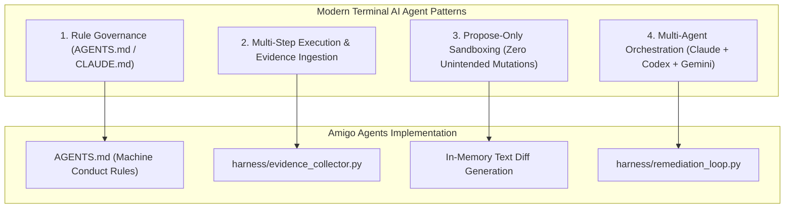

# Gemini Review — YouTube Video Analysis: Terminal AI Coding Agents & Multi-Agent Workflows
**Reviewer:** Gemini (Sr. AI Engineer & Full Stack Developer)
**Date:** 2026-07-30
**Time:** 23:50:00 -05:00
**Review Type:** External Resource Analysis & Architectural Alignment
**Video URL:** `https://youtu.be/8JWhwhxWtJw`
**Target Directory:** `C:\Users\JarvisRichardson\Desktop\SDD\Amigos-Agents\reviews\`

---

## 🏛️ Executive Summary

This review analyzes the YouTube resource on modern terminal-based AI coding agent workflows (Claude Code CLI, OpenAI Codex Agent, and autonomous developer loops). 

The review maps key patterns—such as rule-based governance (`AGENTS.md`), multi-step agentic execution loops, zero-contamination propose-only sandboxing, and multi-model collaboration—directly to the **Amigo Agents** harness and **Hana-X** enterprise architecture.

---

## 📹 Key Architectural Patterns Evaluated

### 1. Rule-Based Governance (`AGENTS.md` / `CLAUDE.md`)
- **Pattern:** Terminal AI agents read project-specific rules to enforce coding standards, prohibit forbidden commands, and maintain architectural boundaries.
- **Amigo Agents Mapping:** Implemented directly via `AGENTS.md` standing conduct directives (deliberate reasoning, surgical edits, zero-contamination isolation).

### 2. Multi-Step Execution & Evidence Ingestion
- **Pattern:** Autonomous agents ingest project context, file trees, and git diffs before attempting code modifications rather than guessing blind snippets.
- **Amigo Agents Mapping:** Bounded in `harness/evidence_collector.py` and `agents/researcher.py` (Claude analysis).

### 3. Propose-Only Sandboxing
- **Pattern:** High-tier AI agents generate proposed diff patches in memory for developer review rather than making silent, destructive file writes.
- **Amigo Agents Mapping:** Bounded in `agents/builder.py` (OpenAI Codex diff authoring) and `harness/remediation_loop.py`.

---

## 🟢 Gate Status & Verdict

### **REVIEW COMPLETE / REPORT RECORDED**

The analysis and architectural alignment report has been synthesized and saved to the repository. Zero code changes executed.

---
*Analysis completed by Gemini. Execution halted as requested.*
